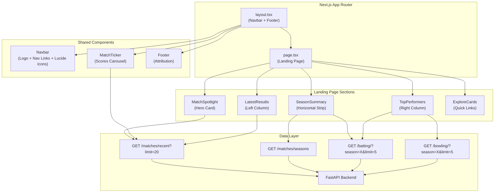
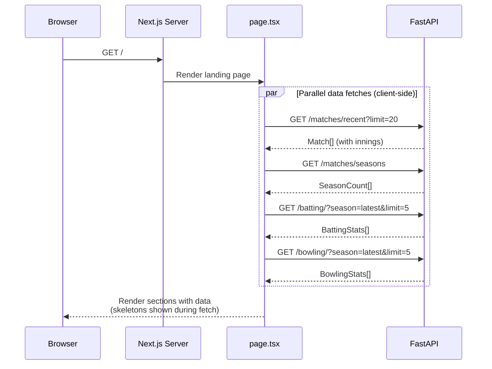
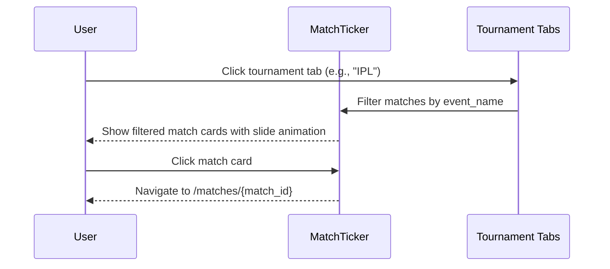

# Design Document: Landing Page Redesign

## Overview

The InsideEdge landing page is being completely redesigned from a basic dark-themed layout with horizontal scrolling match cards into a professional, clean, light-themed experience inspired by Anthropic's aesthetic and ESPNcricinfo's layout. The redesign uses shadcn/ui as the sole component library, Lucide icons (no emojis), and introduces smooth animations via tw-animate-css and CSS transitions.

The new landing page is structured in four distinct sections: (1) a Match Spotlight hero card for the most recent match, (2) a Season at a Glance summary strip, (3) a two-column layout with latest match results and top performers (Orange/Purple Cap), and (4) an Explore section with quick-link cards to Players, Teams, Matches, and Venues. A redesigned navbar and match scores ticker sit above all content. The entire theme flips from dark to light — light backgrounds, dark text, with the existing cyan accent color adapted for the light palette.

The scope is limited to the landing page (`page.tsx`), the root layout (`layout.tsx` for navbar/footer), and the `globals.css` theme. Existing sub-pages (matches, players, teams) are not modified in this spec.

## Architecture



## Sequence Diagrams

### Landing Page Load Flow



### Match Ticker Interaction



## Components and Interfaces

### Component 1: Navbar

**Purpose**: Top navigation bar with InsideEdge branding (Lucide icon, no emoji), navigation links, and clean light-theme styling.

```typescript
// In layout.tsx — replaces existing Navbar function
interface NavLink {
  label: string;
  href: string;
  icon: LucideIcon; // e.g., Trophy, Users, Swords
}

function Navbar(): JSX.Element
// - Sticky top, white background with subtle border-b
// - Left: Lucide "TrendingUp" or "Activity" icon + "InsideEdge" text logo
// - Right: Nav links (Live Scores, Matches, Players, Teams) with Lucide icons
// - Uses shadcn Button variant="ghost" for nav links
// - Backdrop blur on scroll
```

**Responsibilities**:
- Render site branding with a Lucide icon (replacing 🏏 emoji)
- Provide navigation links to core pages
- Remain sticky at top with backdrop blur

### Component 2: MatchTicker

**Purpose**: Horizontal scrolling match scores carousel below the navbar, inspired by ESPNcricinfo's top ticker. Shows recent/live match scores with tournament filter tabs.

```typescript
interface MatchTickerProps {
  matches: TickerMatch[];
}

interface TickerMatch {
  match_id: string;
  team1: string;
  team2: string;
  innings: { innings: number; batting_team: string; total_runs: number; total_wickets: number; overs_played: number }[];
  outcome_winner: string | null;
  winning_margin: string | null;
  match_result_type: string;
  event_name: string | null;
}

function MatchTicker({ matches }: MatchTickerProps): JSX.Element
// - Full-width strip with light gray background (bg-muted)
// - shadcn Tabs for tournament filtering (All, IPL, T20I, etc.)
// - Horizontally scrollable row of compact match score cards
// - Each card: team abbreviations + scores, clickable → /matches/{id}
// - Left/right scroll buttons (Lucide ChevronLeft/ChevronRight)
// - Smooth scroll animation on button click
```

**Responsibilities**:
- Fetch and display recent match scores in a compact ticker format
- Filter by tournament via tabs
- Provide horizontal scrolling with navigation buttons
- Link each card to match detail page

### Component 3: MatchSpotlight

**Purpose**: Hero section showcasing the most recent match as a full-width card with broadcast-style presentation.

```typescript
interface MatchSpotlightProps {
  match: TickerMatch & {
    match_date: string;
    venue: string;
    city: string | null;
    event_stage: string | null;
  };
}

function MatchSpotlight({ match }: MatchSpotlightProps): JSX.Element
// - Full-width shadcn Card with subtle gradient background
// - Large team names with scores prominently displayed
// - Venue, date, event info in muted text
// - Result text in accent color
// - "View Scorecard →" link button
// - Fade-in animation on mount
```

**Responsibilities**:
- Display the most recent match in a visually prominent hero format
- Show both innings scores with team names
- Provide navigation to the full match detail page

### Component 4: SeasonSummary

**Purpose**: Compact horizontal strip showing season-level summary stats.

```typescript
interface SeasonSummaryProps {
  season: string;
  matchCount: number;
  topScorer: { name: string; runs: number } | null;
  topWicketTaker: { name: string; wickets: number } | null;
}

function SeasonSummary(props: SeasonSummaryProps): JSX.Element
// - Narrow horizontal strip with bg-muted/50
// - Lucide icons: Calendar (season), Hash (matches), Flame (top scorer), Target (top wickets)
// - Compact inline layout: "IPL 2025 — 6 matches · Top scorer: V Kohli (287) · Top wickets: YS Chahal (12)"
// - shadcn Separator between items
// - Subtle slide-in animation
```

**Responsibilities**:
- Summarize the current/latest season at a glance
- Show key stats (match count, top performers)

### Component 5: LatestResults

**Purpose**: Left column showing the latest 5-6 match results with scores.

```typescript
interface LatestResultsProps {
  matches: TickerMatch[];
}

function LatestResults({ matches }: LatestResultsProps): JSX.Element
// - shadcn Card containing a list of recent match results
// - Each row: team abbreviations, scores, result badge
// - Alternating subtle row backgrounds
// - "View All Matches →" link at bottom
// - Uses shadcn Badge for result status (Win/Loss/No Result)
// - Staggered fade-in animation for each row
```

**Responsibilities**:
- Display recent match results in a compact list format
- Show team scores and match outcome
- Link to full matches page

### Component 6: TopPerformers

**Purpose**: Right column showing Orange Cap (top run scorers) and Purple Cap (top wicket takers) for the current season.

```typescript
interface TopPerformersProps {
  batters: BattingStats[];
  bowlers: BowlingStats[];
  season: string;
}

function TopPerformers({ batters, bowlers, season }: TopPerformersProps): JSX.Element
// - Two shadcn Cards stacked vertically
// - Orange Cap card: top 5 batters with runs, SR, 4s, 6s
// - Purple Cap card: top 5 bowlers with wickets, economy, avg
// - shadcn Table for stats display
// - Rank badges (#1, #2, etc.) with accent colors
// - Orange/purple color accents for the respective caps
// - Lucide icons: Flame (orange cap), Zap (purple cap)
```

**Responsibilities**:
- Display top 5 batters and bowlers for the current season
- Use color-coded accents (orange for runs, purple for wickets)
- Link player names to their profile pages

### Component 7: ExploreCards

**Purpose**: Quick-link cards for navigating to major sections of the site.

```typescript
interface ExploreCard {
  title: string;
  description: string;
  href: string;
  icon: LucideIcon;
}

function ExploreCards(): JSX.Element
// - Grid of 4 shadcn Cards (2x2 on desktop, 1-col on mobile)
// - Cards: Players, Teams, Matches, Venues
// - Each card: Lucide icon, title, short description
// - Hover effect: subtle scale + shadow transition
// - Click navigates to respective page
```

**Responsibilities**:
- Provide quick navigation to core site sections
- Visual appeal with icons and hover animations

## Data Models

### API Response Types (existing, reused)

```typescript
// From src/lib/types.ts — already defined
interface Match {
  match_id: string;
  season: string;
  match_date: string;
  city: string | null;
  venue: string;
  team1: string;
  team2: string;
  outcome_winner: string | null;
  outcome_by_runs: number | null;
  outcome_by_wickets: number | null;
  match_result_type: string;
  winning_margin: string | null;
  event_name: string | null;
  event_stage: string | null;
}

interface BattingStats {
  batter: string;
  innings: number;
  total_runs: number;
  avg_strike_rate: number;
  total_fours: number;
  total_sixes: number;
}

interface BowlingStats {
  bowler: string;
  innings: number;
  total_wickets: number;
  avg_economy: number;
  bowling_avg: number | null;
}

interface SeasonCount {
  season: string;
  matches: number;
}
```

### Extended Match Type (for ticker/spotlight with innings)

```typescript
interface Innings {
  innings: number;
  batting_team: string;
  total_runs: number;
  total_wickets: number;
  overs_played: number;
}

interface RecentMatch extends Match {
  innings: Innings[];
  floodlit: string | null;
}
```

**Validation Rules**:
- `match_id` is non-empty string
- `innings` array has 0-4 entries (0 for abandoned, 2 for normal, 3-4 for super over)
- `total_runs` >= 0, `total_wickets` between 0 and 10
- `overs_played` > 0 when innings exists
- `season` is a valid year string

</text>
</invoke>

## Key Functions with Formal Specifications

### Function 1: fetchRecentMatches()

```typescript
async function fetchRecentMatches(limit: number = 20): Promise<RecentMatch[]>
```

**Preconditions:**
- `limit` is a positive integer, 1 ≤ limit ≤ 100
- API endpoint `/api/v1/matches/recent` is reachable

**Postconditions:**
- Returns array of `RecentMatch` objects, length ≤ `limit`
- Matches are sorted by `match_date` descending (most recent first)
- Each match has a valid `match_id` and at least `team1`, `team2` populated
- On API failure: returns empty array (graceful degradation)

### Function 2: shortName()

```typescript
function shortName(teamName: string): string
```

**Preconditions:**
- `teamName` is a non-empty string

**Postconditions:**
- If `teamName` exists in the abbreviation map, returns the abbreviation (e.g., "Mumbai Indians" → "MI")
- If `teamName` is not in the map, returns the original `teamName` unchanged
- Return value is always a non-empty string
- Pure function — no side effects

### Function 3: groupMatchesByTournament()

```typescript
function groupMatchesByTournament(matches: RecentMatch[]): Map<string, RecentMatch[]>
```

**Preconditions:**
- `matches` is a valid array (may be empty)

**Postconditions:**
- Returns a Map where keys are tournament names (from `event_name`, or "Other" if null)
- Every match appears in exactly one group
- Sum of all group sizes equals `matches.length`
- Groups are ordered by count descending (largest tournament first)
- Pure function — no side effects, input array not mutated

### Function 4: getLatestSeason()

```typescript
function getLatestSeason(seasons: SeasonCount[]): string | null
```

**Preconditions:**
- `seasons` is a valid array (may be empty)

**Postconditions:**
- Returns the season string with the highest numeric value, or null if array is empty
- Does not mutate input array
- Pure function

### Function 5: formatMatchResult()

```typescript
function formatMatchResult(match: RecentMatch): string
```

**Preconditions:**
- `match` is a valid `RecentMatch` object

**Postconditions:**
- If `match_result_type` is "no_result": returns "No result"
- If `winning_margin` is present: returns "{winner abbreviation} won by {margin}"
- If `outcome_winner` is present but no margin: returns "{winner abbreviation} won"
- Otherwise: returns empty string
- Return value is always a string (never null/undefined)
- Pure function

## Algorithmic Pseudocode

### Landing Page Data Loading

```typescript
// page.tsx — Client component data orchestration
ALGORITHM loadLandingPageData()
OUTPUT: { matches, seasons, topBatters, topBowlers, latestSeason }

BEGIN
  // Step 1: Fetch all data in parallel
  const [matches, seasons] = await Promise.all([
    fetchRecentMatches(20),
    fetchSeasons()
  ])

  // Step 2: Derive latest season from seasons data
  const latestSeason = getLatestSeason(seasons)

  // Step 3: Fetch season-specific stats (depends on Step 2)
  let topBatters: BattingStats[] = []
  let topBowlers: BowlingStats[] = []

  IF latestSeason !== null THEN
    [topBatters, topBowlers] = await Promise.all([
      fetchBattingStats(latestSeason, 5),
      fetchBowlingStats(latestSeason, 5)
    ])
  END IF

  RETURN { matches, seasons, topBatters, topBowlers, latestSeason }
END
```

**Preconditions:**
- API is reachable (graceful degradation if not)
- Component is mounted in browser (client-side)

**Postconditions:**
- All state variables are populated (possibly with empty arrays on failure)
- Loading skeletons are replaced with actual content
- No partial renders — all sections update together or show skeletons

### Match Ticker Scroll Algorithm

```typescript
ALGORITHM scrollTicker(direction: "left" | "right", containerRef: HTMLDivElement)
INPUT: direction, containerRef
OUTPUT: smooth scroll of ticker container

BEGIN
  const scrollAmount = 300 // pixels per click
  const currentScroll = containerRef.scrollLeft

  IF direction === "left" THEN
    targetScroll = Math.max(0, currentScroll - scrollAmount)
  ELSE
    targetScroll = Math.min(
      containerRef.scrollWidth - containerRef.clientWidth,
      currentScroll + scrollAmount
    )
  END IF

  containerRef.scrollTo({
    left: targetScroll,
    behavior: "smooth"
  })
END
```

**Preconditions:**
- `containerRef` is a valid mounted DOM element
- `direction` is either "left" or "right"

**Postconditions:**
- Container scrolls by `scrollAmount` pixels in the given direction
- Scroll position is clamped to valid bounds (0 to max scroll)
- Animation is smooth (browser-native smooth scrolling)

**Loop Invariants:** N/A (no loops)

### Tournament Tab Filtering

```typescript
ALGORITHM filterByTournament(matches: RecentMatch[], activeTab: string): RecentMatch[]
INPUT: matches array, activeTab string
OUTPUT: filtered matches array

BEGIN
  IF activeTab === "all" THEN
    RETURN matches
  END IF

  RETURN matches.filter(m => (m.event_name ?? "Other") === activeTab)
END
```

**Preconditions:**
- `matches` is a valid array
- `activeTab` is a non-empty string

**Postconditions:**
- If activeTab is "all", returns the full array (same reference)
- Otherwise, returns a new array containing only matches where event_name matches activeTab
- Original array is not mutated
- Result length ≤ input length

## Example Usage

```typescript
// page.tsx — Landing page composition
import { MatchTicker } from "@/components/home/match-ticker";
import { MatchSpotlight } from "@/components/home/match-spotlight";
import { SeasonSummary } from "@/components/home/season-summary";
import { LatestResults } from "@/components/home/latest-results";
import { TopPerformers } from "@/components/home/top-performers";
import { ExploreCards } from "@/components/home/explore-cards";

export default function Home() {
  return (
    <div className="min-h-screen bg-background">
      {/* Section 1: Match Spotlight — hero card */}
      <MatchSpotlight />

      {/* Section 2: Season at a Glance — compact strip */}
      <SeasonSummary />

      {/* Section 3: Two-column — results + top performers */}
      <div className="max-w-6xl mx-auto px-4 py-8 grid grid-cols-1 lg:grid-cols-5 gap-6">
        <div className="lg:col-span-3">
          <LatestResults />
        </div>
        <div className="lg:col-span-2">
          <TopPerformers />
        </div>
      </div>

      {/* Section 4: Explore — quick link cards */}
      <ExploreCards />
    </div>
  );
}
```

```typescript
// Example: Navbar with Lucide icons (no emojis)
import { Activity, Trophy, Users, Swords } from "lucide-react";
import { Button } from "@/components/ui/button";
import Link from "next/link";

function Navbar() {
  return (
    <header className="sticky top-0 z-50 w-full border-b bg-background/95 backdrop-blur-md">
      <div className="max-w-6xl mx-auto px-4 flex items-center justify-between h-14">
        <Link href="/" className="flex items-center gap-2">
          <Activity className="h-5 w-5 text-primary" />
          <span className="font-semibold text-lg tracking-tight">InsideEdge</span>
        </Link>
        <nav className="flex items-center gap-1">
          <Button variant="ghost" size="sm" asChild>
            <Link href="/matches"><Trophy className="h-4 w-4 mr-1.5" />Matches</Link>
          </Button>
          <Button variant="ghost" size="sm" asChild>
            <Link href="/players"><Users className="h-4 w-4 mr-1.5" />Players</Link>
          </Button>
          <Button variant="ghost" size="sm" asChild>
            <Link href="/teams"><Swords className="h-4 w-4 mr-1.5" />Teams</Link>
          </Button>
        </nav>
      </div>
    </header>
  );
}
```

```typescript
// Example: MatchTicker compact card
function TickerCard({ match }: { match: RecentMatch }) {
  const inn1 = match.innings?.find(i => i.innings === 1);
  const inn2 = match.innings?.find(i => i.innings === 2);

  return (
    <Link href={`/matches/${match.match_id}`}>
      <Card className="w-[200px] flex-shrink-0 hover:shadow-md transition-shadow cursor-pointer">
        <CardContent className="p-3 space-y-1">
          <div className="flex justify-between text-xs">
            <span className="font-medium">{shortName(inn1?.batting_team ?? match.team1)}</span>
            <span className="font-mono">{inn1 ? `${inn1.total_runs}/${inn1.total_wickets}` : "-"}</span>
          </div>
          <div className="flex justify-between text-xs">
            <span className="font-medium">{shortName(inn2?.batting_team ?? match.team2)}</span>
            <span className="font-mono">{inn2 ? `${inn2.total_runs}/${inn2.total_wickets}` : "-"}</span>
          </div>
          <p className="text-[10px] text-muted-foreground truncate">
            {formatMatchResult(match)}
          </p>
        </CardContent>
      </Card>
    </Link>
  );
}
```

## Correctness Properties

*A property is a characteristic or behavior that should hold true across all valid executions of a system — essentially, a formal statement about what the system should do. Properties serve as the bridge between human-readable specifications and machine-verifiable correctness guarantees.*

### Property 1: shortName idempotency

*For any* string `x`, applying `shortName` twice produces the same result as applying it once: `shortName(shortName(x)) === shortName(x)`. This ensures abbreviations are stable and do not chain-transform.

**Validates: Requirement 11.2**

### Property 2: Tournament grouping is a complete partition

*For any* array of RecentMatch objects, `groupMatchesByTournament` produces groups where the sum of all group sizes equals the input array length, every match appears in exactly one group, and any match with a null `event_name` appears in the group keyed `"Other"`.

**Validates: Requirements 11.3, 11.4, 16.3**

### Property 3: Tournament filter correctness

*For any* array of RecentMatch objects and any active tab string, if the tab is `"all"` then `filterByTournament` returns the full input array unchanged; if the tab is a specific tournament name, then every match in the result has an `event_name` equal to that tournament name, and the result length is less than or equal to the input length.

**Validates: Requirements 3.7, 3.8**

### Property 4: getLatestSeason returns the maximum

*For any* non-empty array of SeasonCount objects, `getLatestSeason` returns the season string whose numeric value is strictly greater than or equal to all other season values in the array. For an empty array, it returns `null`.

**Validates: Requirement 11.5**

### Property 5: formatMatchResult is a total function with correct mapping

*For any* valid RecentMatch object, `formatMatchResult` returns a string (never throws). When `match_result_type` is `"no_result"`, the return value is `"No result"`. When `winning_margin` is present, the return value contains the winner abbreviation and the margin. When `outcome_winner` is present but `winning_margin` is absent, the return value contains the winner abbreviation.

**Validates: Requirements 11.6, 11.7, 16.4**

### Property 6: Match card navigation integrity

*For any* RecentMatch rendered as a clickable card in any section (Match_Ticker, Match_Spotlight, Latest_Results), the card's navigation link href is exactly `/matches/{match_id}` where `match_id` is the `match_id` field from the source data object.

**Validates: Requirements 3.3, 13.1**

### Property 7: Score display accuracy

*For any* RecentMatch with innings data rendered in any section, the displayed `total_runs` and `total_wickets` values exactly match the corresponding values from the API response innings object. No rounding, truncation, or transformation is applied.

**Validates: Requirement 14.1**

## Error Handling

### Error Scenario 1: API Unreachable (Cold Start)

**Condition**: The Render-hosted API is sleeping (free tier spins down after 15 min idle). First request times out or takes 30+ seconds.
**Response**: Show full-page skeleton layout immediately. Each section renders its own skeleton independently. After 10s timeout, show a subtle "Data is loading — the API may be waking up" message below the skeletons.
**Recovery**: Automatic — once the API responds, data populates and skeletons are replaced. No manual refresh needed.

### Error Scenario 2: Partial API Failure

**Condition**: `/matches/recent` succeeds but `/batting/` or `/bowling/` fails.
**Response**: Sections with data render normally. Failed sections show a compact empty state: "Stats unavailable" with a muted icon. No error toasts or modals.
**Recovery**: User can refresh the page. Each section fetches independently, so a partial failure doesn't block other sections.

### Error Scenario 3: Empty Data

**Condition**: API returns empty arrays (e.g., no matches for a season, no batting stats).
**Response**: Sections with empty data show contextual empty states (e.g., "No recent matches" with a Calendar icon). The section still renders its container — no layout shift.
**Recovery**: N/A — this is a valid state, not an error.

### Error Scenario 4: Malformed API Response

**Condition**: API returns unexpected shape (missing fields, wrong types).
**Response**: Components use optional chaining and nullish coalescing throughout. Missing `innings` → show dashes instead of scores. Missing `event_name` → group under "Other". Missing `winning_margin` → show "Result" without details.
**Recovery**: No crash. Degraded display is acceptable.

## Testing Strategy

### Unit Testing Approach

- Test pure utility functions: `shortName()`, `formatMatchResult()`, `groupMatchesByTournament()`, `getLatestSeason()`
- Test with edge cases: empty arrays, null fields, unknown team names, matches with no innings
- Verify abbreviation map covers all known IPL teams (19 teams in dim_teams)

### Property-Based Testing Approach

**Property Test Library**: fast-check

- `shortName` idempotency: `shortName(shortName(x))` should equal `shortName(x)` for all strings
- `groupMatchesByTournament` partition property: sum of all group sizes equals input length for any array of matches
- `filterByTournament` with "all" is identity: output equals input for any matches array
- `formatMatchResult` always returns a string (never throws) for any valid match shape

### Integration Testing Approach

- Render landing page with mocked API responses, verify all 4 sections appear
- Verify skeleton states render when data is loading
- Verify tournament tab filtering updates the displayed matches correctly
- Verify navigation links point to correct routes

## Performance Considerations

- **Parallel Data Fetching**: All independent API calls fire simultaneously via `Promise.all()`. Season-dependent calls (batting/bowling stats) fire in a second parallel batch after season is determined.
- **Image-Free Design**: No images to load — all visuals are CSS + Lucide SVG icons (inline, no network requests).
- **CSS Animations Only**: All transitions use `transform` and `opacity` (GPU-composited). No JavaScript animation libraries needed. `tw-animate-css` provides keyframe animations.
- **Minimal Bundle**: shadcn components are copied into the project (not imported from a package), so tree-shaking is automatic. Lucide icons are individually imported.
- **Skeleton-First Rendering**: Page shell renders instantly with skeletons. Data populates progressively. No blank screen or layout shift.

## Security Considerations

- **No User Input**: Landing page is read-only. No forms, no user-generated content, no authentication.
- **API URL from Environment**: `NEXT_PUBLIC_API_URL` is the only external configuration. No secrets on the client.
- **External Links**: Cricsheet attribution link uses `rel="noopener noreferrer"` and `target="_blank"`.
- **XSS Prevention**: All dynamic content is rendered via React JSX (auto-escaped). No `dangerouslySetInnerHTML`.

## Dependencies

- **shadcn/ui** (already installed): Card, Button, Badge, Tabs, Table, Skeleton, Separator — all from `@/components/ui/`
- **lucide-react** (already installed): Activity, Trophy, Users, Swords, ChevronLeft, ChevronRight, Calendar, Flame, Target, Zap, MapPin, BarChart3, ArrowRight
- **tw-animate-css** (already installed): CSS keyframe animations for fade-in, slide-in effects
- **next/link** (built-in): Client-side navigation
- **next/font/google** (built-in): Geist font family (already configured)

No new dependencies are required. The redesign uses only what's already in `package.json`.

## Theme Changes (Dark → Light)

The `globals.css` `:root` variables must be updated from the current dark palette to a light palette:

| Variable | Current (Dark) | New (Light) |
|----------|---------------|-------------|
| `--background` | `oklch(0.13 0.005 260)` | `oklch(0.98 0.002 260)` |
| `--foreground` | `oklch(0.93 0 0)` | `oklch(0.14 0.005 260)` |
| `--card` | `oklch(0.18 0.005 260)` | `oklch(1.0 0 0)` |
| `--card-foreground` | `oklch(0.93 0 0)` | `oklch(0.14 0.005 260)` |
| `--primary` | `oklch(0.78 0.14 190)` | `oklch(0.45 0.15 190)` |
| `--primary-foreground` | `oklch(0.13 0 0)` | `oklch(0.98 0 0)` |
| `--secondary` | `oklch(0.24 0.005 260)` | `oklch(0.96 0.002 260)` |
| `--muted` | `oklch(0.24 0.005 260)` | `oklch(0.96 0.002 260)` |
| `--muted-foreground` | `oklch(0.60 0.01 260)` | `oklch(0.45 0.01 260)` |
| `--border` | `oklch(0.28 0.005 260)` | `oklch(0.91 0.002 260)` |

The `--primary` hue (190 = cyan/teal) is preserved but darkened for light backgrounds. The dark theme values move to a `.dark` variant for future toggle support.

## File Changes Summary

| File | Action | Description |
|------|--------|-------------|
| `apps/web/src/app/globals.css` | Modify | Flip `:root` to light theme, move dark values to `.dark` |
| `apps/web/src/app/layout.tsx` | Modify | Redesign Navbar (Lucide icon, ghost buttons, nav links) |
| `apps/web/src/app/page.tsx` | Rewrite | New 4-section landing page composition |
| `apps/web/src/components/home/match-ticker.tsx` | Create | Horizontal match scores carousel with tabs |
| `apps/web/src/components/home/match-spotlight.tsx` | Create | Hero card for most recent match |
| `apps/web/src/components/home/season-summary.tsx` | Create | Compact season stats strip |
| `apps/web/src/components/home/latest-results.tsx` | Create | Left column — recent match results list |
| `apps/web/src/components/home/top-performers.tsx` | Create | Right column — Orange/Purple Cap tables |
| `apps/web/src/components/home/explore-cards.tsx` | Create | Quick-link navigation cards |
| `apps/web/src/components/home/recent-matches.tsx` | Delete | Replaced by match-ticker + match-spotlight |
| `apps/web/src/components/home/tournament-sections.tsx` | Delete | Replaced by explore-cards + season-summary |
