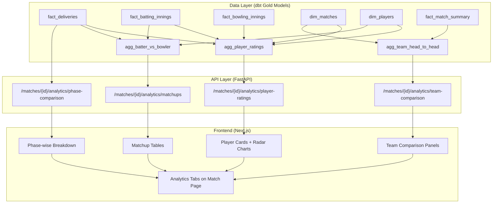
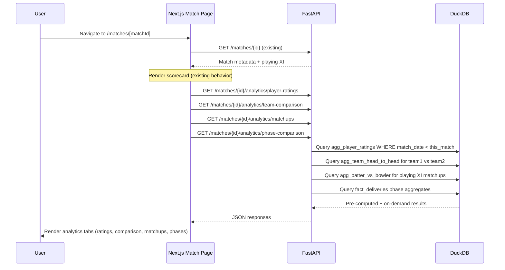
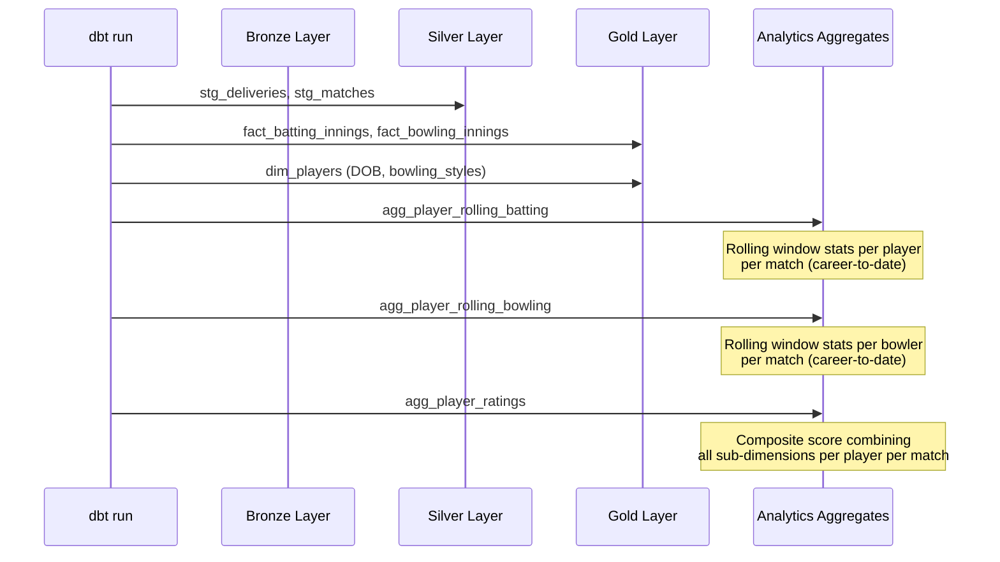

# Design Document: Match Analytics

## Overview

The match-analytics feature adds a sophisticated analytics layer to the match detail page (`/matches/[matchId]`), transforming it from a basic scorecard into an insight-rich experience. The feature computes three interconnected analytics domains: **Player Ratings** (a composite, time-contextual score for each player at the time of a specific match), **Team Comparison** (side-by-side team strength analysis across multiple dimensions), and **Historical Matchups** (batter vs bowler, team vs team, and phase-wise breakdowns with historical depth).

All computations are derived exclusively from existing ball-by-ball data in DuckDB (278K+ deliveries across 1169+ IPL matches) plus ESPN enrichment data (DOB, bowling styles, playing roles). The analytics are materialized as new dbt gold layer models for pre-computed metrics and supplemented by FastAPI endpoints for match-specific, on-demand aggregations. The frontend renders these as player cards with radar charts, side-by-side team comparison panels, and matchup tables — insights that Cricbuzz and ESPNcricinfo don't offer.

Key design constraint: all metrics must be **time-contextual** — a player's rating for a 2015 match uses only data from matches played before that date. This eliminates future-data leakage and makes ratings historically accurate (Kohli in 2011 ≠ Kohli in 2020).

## Architecture



## Sequence Diagrams

### Match Analytics Page Load



### Player Rating Computation Flow



## Components and Interfaces

### Component 1: Analytics dbt Models (Data Layer)

**Purpose**: Pre-compute rolling player statistics and team aggregates so that API queries are fast lookups rather than expensive window-function scans at request time.

**New dbt Models**:

| Model | Grain | Description |
|-------|-------|-------------|
| `agg_player_rolling_batting` | player × match | Career-to-date batting stats as of each match date |
| `agg_player_rolling_bowling` | player × match | Career-to-date bowling stats as of each match date |
| `agg_player_venue_stats` | player × venue | Batting/bowling stats per player per venue |
| `agg_player_vs_bowling_style` | batter × bowling_style_category | Batter performance vs pace/spin |
| `agg_batter_vs_bowler` | batter × bowler | Head-to-head batter vs bowler stats |
| `agg_team_head_to_head` | team × opponent | Historical team vs team record |
| `agg_player_ratings` | player × match | Final composite rating per player per match |

**Responsibilities**:
- Compute all rolling/cumulative stats using DuckDB window functions
- Classify bowlers as pace/spin using `dim_players.bowling_styles`
- Normalize all sub-scores to 0–100 scale
- Ensure time-contextuality: every stat for match M uses only data from matches with `match_date < M.match_date`

### Component 2: Analytics API Router (API Layer)

**Purpose**: Serve match-specific analytics as JSON endpoints, combining pre-computed dbt aggregates with lightweight on-demand queries.

**Interface**:

```python
# src/api/routers/analytics.py
router = APIRouter(prefix="/api/v1/matches/{match_id}/analytics", tags=["analytics"])

@router.get("/player-ratings")
def get_player_ratings(match_id: str, db: DbQuery) -> list[dict]:
    """Player composite ratings for all players in this match's playing XI."""
    ...

@router.get("/team-comparison")
def get_team_comparison(match_id: str, db: DbQuery) -> dict:
    """Side-by-side team strength comparison for the two teams."""
    ...

@router.get("/matchups")
def get_matchups(match_id: str, db: DbQuery) -> list[dict]:
    """Key batter vs bowler matchups between the two playing XIs."""
    ...

@router.get("/phase-comparison")
def get_phase_comparison(match_id: str, db: DbQuery) -> dict:
    """Phase-wise (powerplay/middle/death) comparison for both teams."""
    ...
```

**Responsibilities**:
- Look up match metadata to determine playing XI, teams, venue, date
- Query pre-computed aggregates filtered to the match context
- Compute lightweight on-demand aggregations (phase stats, form windows)
- Return structured JSON matching frontend TypeScript types

### Component 3: Analytics UI Components (Frontend)

**Purpose**: Render analytics data as interactive visualizations on the match detail page.

**Interface**:

```typescript
// apps/web/src/components/analytics/player-rating-card.tsx
interface PlayerRatingCardProps {
  player: PlayerRating;
  teamColor: string;
}

// apps/web/src/components/analytics/team-comparison-panel.tsx
interface TeamComparisonPanelProps {
  team1: TeamAnalytics;
  team2: TeamAnalytics;
  headToHead: HeadToHeadRecord;
}

// apps/web/src/components/analytics/matchup-table.tsx
interface MatchupTableProps {
  matchups: BatterVsBowlerMatchup[];
}

// apps/web/src/components/analytics/radar-chart.tsx
interface RadarChartProps {
  axes: { label: string; value: number; max: number }[];
  color: string;
  size?: number;
}
```

**Responsibilities**:
- Render player cards in a horizontal bar layout per team (playing XI)
- Draw radar/spider charts using SVG (no external charting library — keep bundle small)
- Display side-by-side team comparison with bar indicators
- Show matchup tables with historical batter vs bowler stats
- Handle loading states and empty data gracefully

## Data Models

### PlayerRating (composite score per player per match)

```typescript
interface PlayerRating {
  player_name: string;
  espn_player_id: number | null;
  team: string;
  playing_role: string | null;       // "batter", "bowler", "allrounder", "wicketkeeper"
  overall_rating: number;             // 0-100 composite
  
  // Sub-dimension scores (each 0-100)
  experience_score: number;           // matches played before this date
  age_score: number;                  // age at match time (peak years weighted higher)
  batting_score: number;              // avg, SR, consistency, boundary%, big-score freq
  bowling_score: number;              // economy, SR, dot%, wickets/match
  form_score: number;                 // rolling last-N-innings performance
  venue_score: number;                // performance at this specific ground
  pressure_score: number;             // chases with high RRR, batting after collapses
  vs_pace_score: number;              // batting performance against pace bowlers
  vs_spin_score: number;              // batting performance against spin bowlers
  adaptability_score: number;         // variance across different venues
}
```

**Validation Rules**:
- All scores are in range [0, 100]
- `overall_rating` is a weighted average of sub-dimensions
- Weights differ by `playing_role` (batters weight batting higher, bowlers weight bowling higher)
- Players with fewer than 5 career innings get a confidence penalty

### TeamAnalytics (team-level comparison)

```typescript
interface TeamAnalytics {
  team_name: string;
  primary_color: string;
  
  // Batting strength
  batting_depth_score: number;        // how deep the batting order contributes
  top_order_avg: number;              // avg of positions 1-3
  middle_order_avg: number;           // avg of positions 4-6
  lower_order_contribution: number;   // runs from positions 7-11
  boundary_percentage: number;        // % of runs from 4s and 6s
  
  // Bowling strength
  pace_bowling_score: number;         // combined pace bowler quality
  spin_bowling_score: number;         // combined spin bowler quality
  death_bowling_economy: number;      // economy in death overs
  dot_ball_percentage: number;        // % of deliveries that are dots
  
  // Form & record
  recent_form: string;                // "WWLWW" last 5 matches
  win_percentage: number;             // overall win %
  venue_record: VenueRecord;         // W/L at this venue
  
  // Captaincy
  captain_name: string;
  captain_win_percentage: number;     // win % as captain
}

interface VenueRecord {
  matches: number;
  wins: number;
  losses: number;
  win_percentage: number;
}

interface HeadToHeadRecord {
  total_matches: number;
  team1_wins: number;
  team2_wins: number;
  no_results: number;
  last_5_results: string[];           // ["team1", "team2", "team1", ...]
}
```

### BatterVsBowlerMatchup

```typescript
interface BatterVsBowlerMatchup {
  batter: string;
  batter_team: string;
  bowler: string;
  bowler_team: string;
  bowler_style: string;               // "right-arm fast", "slow left-arm orthodox", etc.
  balls_faced: number;
  runs_scored: number;
  dismissals: number;
  strike_rate: number;
  dot_ball_percentage: number;
  boundary_percentage: number;        // % of balls that went for 4 or 6
}
```

### PhaseComparison

```typescript
interface PhaseComparison {
  team1: PhaseStats;
  team2: PhaseStats;
  venue_averages: PhaseStats;         // historical averages at this venue
}

interface PhaseStats {
  team_name: string;
  powerplay: PhaseDetail;
  middle: PhaseDetail;
  death: PhaseDetail;
}

interface PhaseDetail {
  avg_runs: number;
  avg_wickets: number;
  avg_run_rate: number;
  boundary_percentage: number;
  dot_ball_percentage: number;
  matches_sample_size: number;        // how many matches this is based on
}
```


## Algorithmic Pseudocode

### Algorithm 1: Player Composite Rating Computation

The core algorithm computes a time-contextual composite rating for a player at a specific match. All historical stats are computed using only matches played **before** the target match date.

```sql
-- agg_player_ratings (dbt model)
-- Grain: one row per player per match they participated in
-- Every stat uses only data from matches BEFORE this match's date

WITH career_to_date_batting AS (
    -- For each (player, match), compute batting stats using only prior matches
    SELECT
        bi.batter AS player_name,
        m.match_id,
        m.match_date,
        m.venue,
        COUNT(*) OVER w AS career_innings,
        AVG(bi.runs_scored) OVER w AS career_avg,
        AVG(bi.strike_rate) OVER w AS career_sr,
        -- Consistency: std deviation of scores (lower = more consistent)
        STDDEV(bi.runs_scored) OVER w AS score_stddev,
        -- Boundary percentage
        SUM(bi.fours + bi.sixes) OVER w * 1.0 
            / NULLIF(SUM(bi.balls_faced) OVER w, 0) AS boundary_pct,
        -- Big score frequency (50+ scores / innings)
        SUM(CASE WHEN bi.runs_scored >= 50 THEN 1 ELSE 0 END) OVER w * 1.0
            / COUNT(*) OVER w AS big_score_freq,
        -- Form: last 10 innings rolling average
        AVG(bi.runs_scored) OVER w_form AS form_avg,
        AVG(bi.strike_rate) OVER w_form AS form_sr
    FROM fact_batting_innings bi
    JOIN dim_matches m ON bi.match_id = m.match_id
    WINDOW 
        w AS (PARTITION BY bi.batter ORDER BY m.match_date 
              ROWS BETWEEN UNBOUNDED PRECEDING AND 1 PRECEDING),
        w_form AS (PARTITION BY bi.batter ORDER BY m.match_date 
                   ROWS BETWEEN 10 PRECEDING AND 1 PRECEDING)
),

career_to_date_bowling AS (
    -- Same pattern for bowling stats
    SELECT
        bo.bowler AS player_name,
        m.match_id,
        m.match_date,
        COUNT(*) OVER w AS career_bowling_innings,
        AVG(bo.economy_rate) OVER w AS career_economy,
        SUM(bo.wickets) OVER w * 1.0 
            / NULLIF(COUNT(*) OVER w, 0) AS wickets_per_match,
        SUM(bo.dot_balls) OVER w * 1.0 
            / NULLIF(SUM(bo.legal_balls) OVER w, 0) AS dot_ball_pct,
        -- Bowling strike rate: balls per wicket
        SUM(bo.legal_balls) OVER w * 1.0 
            / NULLIF(SUM(bo.wickets) OVER w, 0) AS bowling_sr,
        -- Form: last 10 innings
        AVG(bo.economy_rate) OVER w_form AS form_economy,
        SUM(bo.wickets) OVER w_form * 1.0 
            / NULLIF(COUNT(*) OVER w_form, 0) AS form_wickets_per_match
    FROM fact_bowling_innings bo
    JOIN dim_matches m ON bo.match_id = m.match_id
    WINDOW 
        w AS (PARTITION BY bo.bowler ORDER BY m.match_date 
              ROWS BETWEEN UNBOUNDED PRECEDING AND 1 PRECEDING),
        w_form AS (PARTITION BY bo.bowler ORDER BY m.match_date 
                   ROWS BETWEEN 10 PRECEDING AND 1 PRECEDING)
)
```

**Preconditions:**
- `fact_batting_innings` and `fact_bowling_innings` are populated for all historical matches
- `dim_players` has `date_of_birth` and `bowling_styles` from ESPN enrichment
- Window frame `1 PRECEDING` excludes the current match (time-contextuality)

**Postconditions:**
- Every player who appeared in a match has a rating row for that match
- All stats reflect only data from matches played before the target match date
- Players with < 5 career innings have a confidence-penalized rating

**Loop Invariants:**
- The window frame `UNBOUNDED PRECEDING AND 1 PRECEDING` guarantees monotonically increasing sample sizes
- No future data leaks into any rating computation

### Algorithm 2: Bowler Classification (Pace vs Spin)

```sql
-- Classify bowlers using ESPN bowling_styles from dim_players
-- Used to compute batter-vs-pace and batter-vs-spin scores

CASE
    WHEN p.bowling_styles IS NULL THEN 'unknown'
    -- Pace bowlers: fast, medium-fast, medium
    WHEN p.bowling_styles::VARCHAR ILIKE '%fast%'
        OR p.bowling_styles::VARCHAR ILIKE '%medium%'
        OR p.bowling_styles::VARCHAR ILIKE '%rfm%'
        OR p.bowling_styles::VARCHAR ILIKE '%lfm%'
        OR p.bowling_styles::VARCHAR ILIKE '%rf%'
        OR p.bowling_styles::VARCHAR ILIKE '%lf%'
    THEN 'pace'
    -- Spin bowlers: everything else that's a recognized bowling style
    WHEN p.bowling_styles::VARCHAR ILIKE '%spin%'
        OR p.bowling_styles::VARCHAR ILIKE '%orthodox%'
        OR p.bowling_styles::VARCHAR ILIKE '%wrist%'
        OR p.bowling_styles::VARCHAR ILIKE '%sla%'
        OR p.bowling_styles::VARCHAR ILIKE '%ob%'
        OR p.bowling_styles::VARCHAR ILIKE '%lb%'
        OR p.bowling_styles::VARCHAR ILIKE '%leg%'
        OR p.bowling_styles::VARCHAR ILIKE '%off%'
    THEN 'spin'
    ELSE 'unknown'
END AS bowling_category
```

**Preconditions:**
- `dim_players.bowling_styles` is a JSON array of style codes from ESPN enrichment
- Style codes follow ESPN conventions (e.g., `['rfm']` = right-arm fast-medium)

**Postconditions:**
- Every bowler is classified as exactly one of: `'pace'`, `'spin'`, `'unknown'`
- Classification is deterministic and consistent across all models

### Algorithm 3: Score Normalization (0–100 Scale)

```sql
-- Normalize a raw metric to 0-100 using percentile rank within the population
-- Applied independently per sub-dimension

PERCENT_RANK() OVER (
    PARTITION BY metric_context  -- e.g., partition by playing_role for fair comparison
    ORDER BY raw_metric_value
) * 100 AS normalized_score
```

For metrics where lower is better (economy rate, score standard deviation):

```sql
(1.0 - PERCENT_RANK() OVER (
    PARTITION BY metric_context
    ORDER BY raw_metric_value
)) * 100 AS normalized_score
```

**Preconditions:**
- Raw metric values are computed from career-to-date stats
- Population includes all players who have played at least 5 innings

**Postconditions:**
- All normalized scores are in range [0, 100]
- Score of 100 = best in the population for that metric
- Score of 0 = worst in the population for that metric

### Algorithm 4: Composite Rating Weights

```python
# Weight profiles by playing role
ROLE_WEIGHTS = {
    "batter": {
        "experience": 0.05, "age": 0.05, "batting": 0.30,
        "bowling": 0.00, "form": 0.20, "venue": 0.10,
        "pressure": 0.10, "vs_pace": 0.05, "vs_spin": 0.05,
        "adaptability": 0.10,
    },
    "bowler": {
        "experience": 0.05, "age": 0.05, "batting": 0.00,
        "bowling": 0.30, "form": 0.20, "venue": 0.10,
        "pressure": 0.10, "vs_pace": 0.00, "vs_spin": 0.00,
        "adaptability": 0.20,
    },
    "allrounder": {
        "experience": 0.05, "age": 0.05, "batting": 0.20,
        "bowling": 0.20, "form": 0.15, "venue": 0.10,
        "pressure": 0.10, "vs_pace": 0.025, "vs_spin": 0.025,
        "adaptability": 0.10,
    },
    "wicketkeeper": {
        "experience": 0.05, "age": 0.05, "batting": 0.30,
        "bowling": 0.00, "form": 0.20, "venue": 0.10,
        "pressure": 0.10, "vs_pace": 0.05, "vs_spin": 0.05,
        "adaptability": 0.10,
    },
}

# Confidence penalty for small sample sizes
def confidence_factor(innings_count: int, min_innings: int = 5) -> float:
    if innings_count >= min_innings:
        return 1.0
    return innings_count / min_innings  # linear ramp from 0 to 1
```

**Preconditions:**
- All weights for a role sum to 1.0
- `playing_role` is derived from `dim_players.playing_roles` ESPN enrichment

**Postconditions:**
- `overall_rating = sum(weight_i * score_i) * confidence_factor`
- Overall rating is in range [0, 100]
- Players with unknown role use `allrounder` weights as fallback

### Algorithm 5: Pressure Performance Score

```sql
-- Identify "pressure" batting situations from historical data
-- Pressure = chasing with high required run rate OR batting after collapse

WITH pressure_innings AS (
    SELECT
        bi.batter,
        bi.match_id,
        bi.runs_scored,
        bi.strike_rate,
        bi.balls_faced,
        -- High RRR chase: 2nd innings, required rate > 9 at time of batting
        CASE 
            WHEN bi.innings = 2 
                AND ms.total_runs > 0  -- valid target
                AND (ms.total_runs - LAG_RUNS) * 6.0 / NULLIF(REMAINING_BALLS, 0) > 9.0
            THEN TRUE
            ELSE FALSE
        END AS is_high_pressure_chase,
        -- Collapse: team lost 3+ wickets in last 30 balls before this batter came in
        CASE
            WHEN wickets_in_last_30_balls >= 3 THEN TRUE
            ELSE FALSE
        END AS is_post_collapse
    FROM fact_batting_innings bi
    JOIN fact_match_summary ms ON bi.match_id = ms.match_id AND ms.innings = 1
)

-- Pressure score = performance in pressure situations relative to normal
-- Higher score = performs better under pressure
SELECT
    batter,
    AVG(CASE WHEN is_high_pressure_chase OR is_post_collapse 
        THEN runs_scored END) AS pressure_avg,
    AVG(runs_scored) AS overall_avg,
    -- Ratio > 1.0 means player performs better under pressure
    pressure_avg / NULLIF(overall_avg, 0) AS pressure_ratio
FROM pressure_innings
GROUP BY batter
```

**Preconditions:**
- `fact_match_summary` provides first innings total (chase target)
- Ball-by-ball data available to compute wickets-in-last-N-balls

**Postconditions:**
- `pressure_ratio > 1.0` indicates a player who elevates under pressure
- Players with < 3 pressure innings get a neutral score (50)

## Key Functions with Formal Specifications

### Function 1: get_player_ratings()

```python
def get_player_ratings(match_id: str, db: DbQuery) -> list[dict]:
    """Fetch composite player ratings for all players in a match's playing XI."""
```

**Preconditions:**
- `match_id` exists in `dim_matches`
- `agg_player_ratings` dbt model has been materialized
- Match has valid `teams_enrichment_json` with playing XI data

**Postconditions:**
- Returns one rating dict per player in the playing XI (up to 22 players)
- Each rating has `overall_rating` in [0, 100]
- All sub-scores are in [0, 100]
- Players not found in aggregates (e.g., debut match) return with null scores and a flag

**Loop Invariants:** N/A (single query, no iteration)

### Function 2: get_team_comparison()

```python
def get_team_comparison(match_id: str, db: DbQuery) -> dict:
    """Compute side-by-side team analytics for the two teams in a match."""
```

**Preconditions:**
- `match_id` exists in `dim_matches` with valid `team1` and `team2`
- Historical match data exists for both teams

**Postconditions:**
- Returns dict with keys `team1`, `team2`, `head_to_head`
- `head_to_head.total_matches == team1_wins + team2_wins + no_results`
- All percentage values are in [0, 100]
- `recent_form` contains at most 5 characters, each 'W', 'L', or 'N'

### Function 3: get_matchups()

```python
def get_matchups(match_id: str, db: DbQuery) -> list[dict]:
    """Fetch historical batter vs bowler matchups for the playing XIs."""
```

**Preconditions:**
- `match_id` exists in `dim_matches`
- Playing XI available from `teams_enrichment_json` or match `players` data
- `agg_batter_vs_bowler` dbt model has been materialized

**Postconditions:**
- Returns matchups only for batter-bowler pairs where `balls_faced >= 6` (minimum 1 over)
- Each matchup has consistent stats: `runs_scored / balls_faced * 100 ≈ strike_rate`
- Sorted by `balls_faced` descending (most significant matchups first)
- Cross-team only: batters from team1 vs bowlers from team2 and vice versa

### Function 4: get_phase_comparison()

```python
def get_phase_comparison(match_id: str, db: DbQuery) -> dict:
    """Compute phase-wise (powerplay/middle/death) stats for both teams and venue averages."""
```

**Preconditions:**
- `match_id` exists in `dim_matches` with a valid venue
- `fact_deliveries` has phase classification for the match format

**Postconditions:**
- Returns stats for all three phases: powerplay, middle, death
- `venue_averages` computed from all historical matches at the same venue
- `matches_sample_size` reflects actual number of matches used
- All averages are rounded to 2 decimal places

## Example Usage

### API Response: Player Ratings

```json
{
  "match_id": "1417636",
  "match_date": "2025-03-22",
  "team1": "Chennai Super Kings",
  "team2": "Royal Challengers Bengaluru",
  "ratings": [
    {
      "player_name": "V Kohli",
      "espn_player_id": 253802,
      "team": "Royal Challengers Bengaluru",
      "playing_role": "batter",
      "overall_rating": 87.3,
      "experience_score": 95.0,
      "age_score": 72.0,
      "batting_score": 91.5,
      "bowling_score": null,
      "form_score": 78.2,
      "venue_score": 85.0,
      "pressure_score": 82.1,
      "vs_pace_score": 88.0,
      "vs_spin_score": 79.5,
      "adaptability_score": 90.0,
      "career_innings": 237,
      "confidence": 1.0
    }
  ]
}
```

### API Response: Team Comparison

```json
{
  "match_id": "1417636",
  "team1": {
    "team_name": "Chennai Super Kings",
    "primary_color": "#FCCA06",
    "batting_depth_score": 78.5,
    "top_order_avg": 34.2,
    "middle_order_avg": 28.1,
    "boundary_percentage": 58.3,
    "pace_bowling_score": 72.0,
    "spin_bowling_score": 85.0,
    "death_bowling_economy": 9.8,
    "recent_form": "WWLWW",
    "win_percentage": 59.2,
    "venue_record": { "matches": 45, "wins": 28, "losses": 16, "win_percentage": 63.6 },
    "captain_name": "MS Dhoni",
    "captain_win_percentage": 61.5
  },
  "team2": { "..." : "..." },
  "head_to_head": {
    "total_matches": 35,
    "team1_wins": 20,
    "team2_wins": 14,
    "no_results": 1,
    "last_5_results": ["Chennai Super Kings", "Royal Challengers Bengaluru", "Chennai Super Kings", "Chennai Super Kings", "Royal Challengers Bengaluru"]
  }
}
```

### Frontend: Radar Chart Usage

```typescript
// In player-rating-card.tsx
const radarAxes = [
  { label: "Batting", value: player.batting_score ?? 0, max: 100 },
  { label: "Form", value: player.form_score ?? 0, max: 100 },
  { label: "Venue", value: player.venue_score ?? 0, max: 100 },
  { label: "Pressure", value: player.pressure_score ?? 0, max: 100 },
  { label: "Experience", value: player.experience_score ?? 0, max: 100 },
  { label: "vs Pace", value: player.vs_pace_score ?? 0, max: 100 },
];

<RadarChart axes={radarAxes} color={teamColor} size={180} />
```

## Correctness Properties

1. **Time-contextuality**: For any player rating at match M, all underlying statistics must use only data from matches with `match_date < M.match_date`. No future data leakage.

2. **Score bounds**: All normalized scores and the composite `overall_rating` must be in the range [0, 100]. No NaN, no negative values, no values exceeding 100.

3. **Weight consistency**: For every playing role, the sum of all dimension weights must equal exactly 1.0.

4. **Head-to-head integrity**: `head_to_head.total_matches == team1_wins + team2_wins + no_results` for every team pair.

5. **Matchup symmetry**: If batter A faced bowler B for N balls, then the matchup record for (A, B) must show exactly N balls_faced. The stat must be derivable from `fact_deliveries`.

6. **Phase completeness**: Phase comparison must cover all three phases (powerplay, middle, death) for T20 matches. No phase should be missing unless the team has zero historical data for that phase.

7. **Confidence penalty monotonicity**: A player with more career innings must have a confidence factor ≥ a player with fewer innings (given the same minimum threshold).

8. **Venue average sample size**: `venue_averages.matches_sample_size` must equal the actual count of historical matches at that venue, not including the current match.

9. **Playing XI coverage**: Player ratings endpoint must return exactly one entry per player in the playing XI. Missing players (debut, no prior data) must still appear with null scores and `confidence: 0`.

10. **Bowling classification determinism**: The same bowler must always be classified as the same category (pace/spin/unknown) regardless of which match context the classification is computed in.

## Error Handling

### Error Scenario 1: Match Not Found

**Condition**: `match_id` does not exist in `dim_matches`
**Response**: HTTP 404 with `{"detail": "Match 'xyz' not found"}`
**Recovery**: Frontend shows "Match not found" message with back navigation

### Error Scenario 2: No Playing XI Data

**Condition**: Match exists but `teams_enrichment_json` is NULL (ESPN enrichment not yet run for this match)
**Response**: HTTP 200 with empty ratings array and a `"warning": "Playing XI data not available"` field
**Recovery**: Frontend shows "Analytics unavailable — playing XI data missing" with graceful degradation to scorecard-only view

### Error Scenario 3: Player Has No Historical Data (Debut)

**Condition**: A player in the playing XI has no prior matches in the dataset
**Response**: Include the player in ratings with all scores as `null`, `confidence: 0`, and `is_debut: true`
**Recovery**: Frontend renders the player card with a "Debut" badge and no radar chart

### Error Scenario 4: Insufficient Venue Data

**Condition**: Venue has fewer than 3 historical matches for meaningful averages
**Response**: Return venue stats with `matches_sample_size` reflecting actual count, plus `"low_sample_warning": true`
**Recovery**: Frontend shows venue averages with a "Limited data" disclaimer

### Error Scenario 5: DuckDB Query Timeout

**Condition**: Complex analytics query exceeds reasonable response time (>5s)
**Response**: HTTP 504 with timeout message
**Recovery**: Frontend shows "Analytics loading slowly, please retry" with a retry button. Consider pre-computing more aggressively in dbt if this occurs frequently.

## Testing Strategy

### Unit Testing Approach

- **Weight validation**: Assert all role weight profiles sum to 1.0
- **Confidence factor**: Test linear ramp behavior (0 innings → 0.0, 3 innings → 0.6, 5+ innings → 1.0)
- **Bowling classification**: Test known bowling styles map to correct categories (e.g., `['rfm']` → pace, `['sla']` → spin)
- **Score normalization**: Test edge cases (single player, all same values, empty population)

### Property-Based Testing Approach

**Property Test Library**: `hypothesis` (Python) / `fast-check` (TypeScript)

- **Rating bounds property**: For any generated player stats, the composite rating is always in [0, 100]
- **Weight sum property**: For any role string, weights always sum to 1.0
- **Normalization idempotency**: Normalizing already-normalized scores produces the same result
- **Time-contextuality property**: For any two matches M1 (earlier) and M2 (later) by the same player, M2's career stats include M1's data but not vice versa

### Integration Testing Approach

- **dbt model tests**: Add `not_null`, `accepted_values`, and range checks to all new aggregate models in `schema.yml`
- **API endpoint tests**: Test each analytics endpoint with known match IDs, verify response shape and value ranges
- **End-to-end**: Load a fixture match into the test database, run dbt, query analytics endpoints, verify specific expected values

### dbt Data Quality Tests

```yaml
# New tests for analytics models
- name: agg_player_ratings
  tests:
    - unique:
        column_name: "player_name || '|' || match_id"
    - not_null:
        column_name: overall_rating
    - accepted_values:
        column_name: playing_role
        values: ['batter', 'bowler', 'allrounder', 'wicketkeeper', 'unknown']
```

## Performance Considerations

### Pre-computation Strategy

The key performance decision is **what to pre-compute in dbt vs compute on-demand in the API**:

| Metric | Strategy | Rationale |
|--------|----------|-----------|
| Career-to-date batting/bowling stats | dbt (pre-computed) | Window functions over 278K+ deliveries are expensive; compute once |
| Player composite ratings | dbt (pre-computed) | Depends on career stats; chain of window functions |
| Batter vs bowler matchups | dbt (pre-computed) | Cross-join of all batter-bowler pairs; expensive to compute per request |
| Team head-to-head | dbt (pre-computed) | Simple aggregation but queried frequently |
| Phase comparison | API (on-demand) | Lightweight GROUP BY on fact_deliveries filtered to specific teams/venue |
| Recent form (last 5 matches) | API (on-demand) | Small result set, simple ORDER BY LIMIT |

### Query Performance Targets

- Player ratings endpoint: < 100ms (single lookup by match_id in pre-computed table)
- Team comparison endpoint: < 200ms (2-3 queries against pre-computed aggregates)
- Matchups endpoint: < 150ms (filtered lookup in pre-computed batter-vs-bowler table)
- Phase comparison endpoint: < 300ms (on-demand GROUP BY with venue + team filters)

### dbt Model Materialization

All new analytics models should use `materialized='table'` (not incremental) because:
- Window functions with `UNBOUNDED PRECEDING` need the full dataset
- DuckDB rebuilds tables in < 2 seconds at current scale (278K deliveries)
- Incremental adds complexity without meaningful benefit until dataset grows 10x+

### Estimated Model Sizes

| Model | Estimated Rows | Rationale |
|-------|---------------|-----------|
| `agg_player_rolling_batting` | ~17,600 | Same grain as fact_batting_innings |
| `agg_player_rolling_bowling` | ~13,800 | Same grain as fact_bowling_innings |
| `agg_player_venue_stats` | ~5,000 | ~927 players × ~5 avg venues each |
| `agg_player_vs_bowling_style` | ~1,800 | ~927 batters × 2 categories |
| `agg_batter_vs_bowler` | ~15,000 | Unique batter-bowler pairs with ≥1 ball |
| `agg_team_head_to_head` | ~180 | ~19 teams × ~10 opponents each |
| `agg_player_ratings` | ~17,600 | Same grain as rolling batting |

## Security Considerations

- No authentication required (public analytics, read-only)
- All queries use parameterized SQL via DuckDB's `$1` placeholder syntax (no SQL injection)
- Match IDs are validated against `dim_matches` before running analytics queries
- No PII exposed beyond player names (which are already public sports data)
- Rate limiting on analytics endpoints recommended if traffic grows (defer to Phase 4)

## Dependencies

### New dbt Models (7 models)
- `agg_player_rolling_batting` — depends on `fact_batting_innings`, `dim_matches`
- `agg_player_rolling_bowling` — depends on `fact_bowling_innings`, `dim_matches`
- `agg_player_venue_stats` — depends on `fact_batting_innings`, `fact_bowling_innings`, `dim_venues`
- `agg_player_vs_bowling_style` — depends on `fact_deliveries`, `dim_players`
- `agg_batter_vs_bowler` — depends on `fact_deliveries`, `dim_players`
- `agg_team_head_to_head` — depends on `dim_matches`
- `agg_player_ratings` — depends on all above rolling/venue models + `dim_players`

### New API Router (1 file)
- `src/api/routers/analytics.py` — depends on `src/api/database.py`, `src/tables.py`

### New Frontend Components (~6 files)
- `apps/web/src/components/analytics/radar-chart.tsx` — SVG-based, no external deps
- `apps/web/src/components/analytics/player-rating-card.tsx` — uses shadcn/ui Card
- `apps/web/src/components/analytics/team-comparison-panel.tsx` — uses shadcn/ui components
- `apps/web/src/components/analytics/matchup-table.tsx` — uses shadcn/ui Table
- `apps/web/src/components/analytics/phase-comparison.tsx` — uses shadcn/ui components
- `apps/web/src/components/analytics/analytics-tabs.tsx` — tab container using shadcn/ui Tabs

### External Libraries
- None new. All visualization is custom SVG (radar charts). No Recharts, D3, or Chart.js needed.
- Frontend uses existing: React, Tailwind CSS, shadcn/ui, lucide-react
- Backend uses existing: FastAPI, DuckDB, dbt-core, dbt-duckdb

### Table Reference Updates
- Add new aggregate table constants to `src/tables.py`
