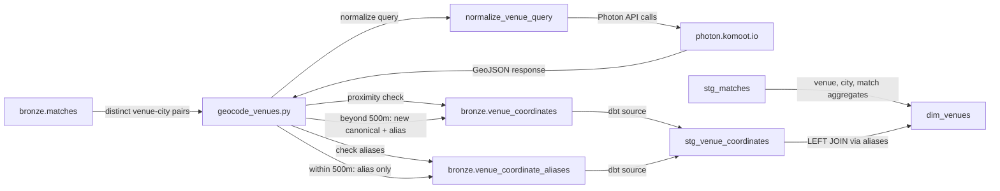
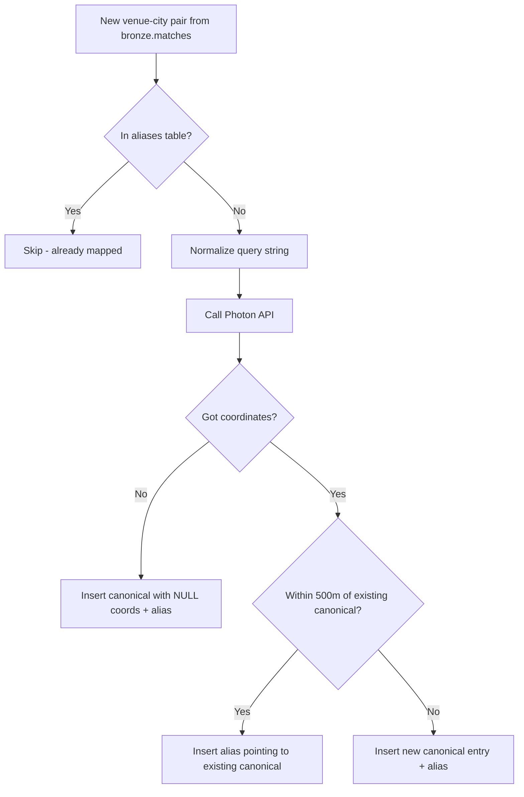
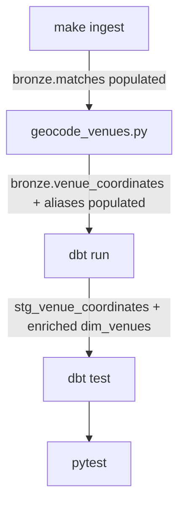

# Design Document: Venue Coordinates Enrichment

## Overview

This design adds geographic coordinates (latitude/longitude) to all IPL venues by geocoding venue-city pairs via the Photon API — a free, open-source geocoding service powered by OpenStreetMap data and ElasticSearch fuzzy matching. The pipeline follows the project's existing medallion architecture: a Python geocoding script writes results into two new bronze tables (`bronze.venue_coordinates` for canonical geocoded locations and `bronze.venue_coordinate_aliases` for mapping name variations), dbt transforms them through silver (`stg_venue_coordinates`) into the enriched gold `dim_venues` model.

The design is idempotent: on a fresh clone, all ~63 venues are geocoded; on subsequent runs, only new venues (delta) are processed. Proximity-based deduplication (500m Haversine threshold) ensures that the same physical stadium appearing under different (venue, city) combinations in Cricsheet data is not geocoded redundantly — instead, name variations are recorded as aliases pointing to a single canonical entry. No seed CSVs, no hardcoded data, no API keys. This is Phase 1.1 of the enrichment roadmap — a prerequisite for the weather pipeline (Phase 1.2) which needs lat/lng to query Open-Meteo.

### Key Design Decisions

1. **Photon over Nominatim**: Photon's fuzzy/typo-tolerant matching handles cricket venue names better than strict Nominatim searches. POC validated this with 5/5 correct results.
2. **Bronze table (not seed CSV)**: Coordinates are API-derived data, not manually curated. Storing in bronze follows the medallion pattern and enables delta logic.
3. **Two-table design (canonical + aliases)**: The same physical stadium can appear with different (venue, city) combinations in Cricsheet data (e.g., "M Chinnaswamy Stadium, Bangalore" vs "M Chinnaswamy Stadium, Bengaluru"). A canonical table stores one row per physical stadium; an aliases table maps every name variation to its canonical entry. Proximity-based deduplication (500m Haversine) prevents duplicate canonical entries.
4. **500m proximity threshold**: Wankhede Stadium and Brabourne Stadium in Mumbai are the closest IPL venues at exactly 700m apart. A 500m threshold correctly distinguishes genuinely different stadiums while catching name variations of the same stadium (which geocode to within ~50m of each other).
5. **Query normalization**: Venue strings from Cricsheet contain embedded city/state info and generic terms ("cricket", "stadium", "international") that confuse geocoders. A normalization step strips these before querying Photon, improving match quality.
6. **NULL for unresolvable venues**: Rather than failing the pipeline, venues that Photon can't resolve get NULL coordinates. Downstream models handle NULLs gracefully via LEFT JOIN.

## Architecture

### Data Flow



### Alias Resolution Flow



### Pipeline Execution Order



In Dagster, the dependency chain is:
`bronze_matches` → `bronze_venue_coordinates` → dbt assets (including `stg_venue_coordinates` → `dim_venues`)

### Integration with Existing Pipeline

The geocoding step slots between ingestion and transformation in the existing `make all` flow:

```
make all (updated):
  1. setup          — install deps
  2. ingest         — download Cricsheet → bronze.matches, bronze.deliveries, bronze.people
  3. enrich         — geocode venues → bronze.venue_coordinates + bronze.venue_coordinate_aliases  ← NEW
  4. transform      — dbt run (bronze → silver → gold)
```

## Components and Interfaces

### 1. Geocoding Script (`src/enrichment/geocode_venues.py`)

The main enrichment module. Follows the same patterns as `src/ingestion/bronze_loader.py`.

#### Function Signatures

```python
def normalize_venue_query(venue: str, city: str | None) -> str:
    """
    Normalize a venue string into a clean Photon search query.
    
    Steps:
      1. Truncate venue at first comma (strip embedded city/state)
      2. Remove "cricket", "stadium", "international" (case-insensitive)
      3. Collapse multiple whitespace to single space, strip leading/trailing
      4. Append " Cricket Stadium"
      5. Append ", {city}" if city is not None
    
    Args:
        venue: Raw venue name from Cricsheet (e.g. "Wankhede Stadium")
        city: City name from Cricsheet, or None
    
    Returns:
        Normalized query string for Photon API.
    
    Examples:
        >>> normalize_venue_query("Wankhede Stadium", "Mumbai")
        "Wankhede Cricket Stadium, Mumbai"
        >>> normalize_venue_query("Dubai International Cricket Stadium", "Dubai")
        "Dubai Cricket Stadium, Dubai"
        >>> normalize_venue_query("Punjab Cricket Association IS Bindra Stadium, Mohali, Chandigarh", "Chandigarh")
        "Punjab Association IS Bindra Cricket Stadium, Chandigarh"
        >>> normalize_venue_query("The Oval", None)
        "The Oval Cricket Stadium"
    """

def get_venues_to_geocode(conn: duckdb.DuckDBPyConnection) -> list[tuple[str, str]]:
    """
    Query distinct venue-city pairs from bronze.matches that are NOT yet
    in bronze.venue_coordinate_aliases. Returns list of (venue, city) tuples.
    
    On fresh clone (tables don't exist): returns ALL venue-city pairs.
    On subsequent runs: returns only the delta (new venues not in aliases).
    """

def geocode_venue(venue: str, city: str) -> dict:
    """
    Normalize the query, then call Photon API for a single venue-city pair.
    
    Args:
        venue: Venue name from Cricsheet (e.g. "Wankhede Stadium")
        city: City name from Cricsheet (e.g. "Mumbai")
    
    Returns:
        dict with keys: venue, city, latitude, longitude, photon_name,
                        country, state, osm_value, geocoded_at
        latitude/longitude are None if Photon returns no results.
        country/state/osm_value are None if not present in response or no results.
    
    Raises:
        Does not raise — retries up to 3 times on HTTP errors, then returns
        row with NULL coordinates and logs the failure.
    """

def find_nearby_canonical(
    conn: duckdb.DuckDBPyConnection, lat: float, lon: float, threshold_m: float = 500
) -> tuple[str, str] | None:
    """
    Check if the given coordinates fall within threshold_m meters of any
    existing canonical entry in bronze.venue_coordinates using Haversine distance.
    
    Args:
        conn: DuckDB connection
        lat: Latitude of the new venue
        lon: Longitude of the new venue
        threshold_m: Distance threshold in meters (default 500)
    
    Returns:
        (venue, city) tuple of the nearest canonical entry if within threshold,
        or None if no canonical entry is within threshold_m meters.
    """

def load_venue_coordinates_to_bronze(
    canonical_rows: list[dict], alias_rows: list[dict]
) -> tuple[int, int]:
    """
    Insert geocoded canonical venue rows into bronze.venue_coordinates
    and alias mappings into bronze.venue_coordinate_aliases.
    Creates tables if they don't exist. Appends new rows (delta only).
    
    Args:
        canonical_rows: List of dicts for new canonical entries
        alias_rows: List of dicts for alias mappings
    
    Returns:
        Tuple of (canonical_rows_inserted, alias_rows_inserted).
    """

def run_venue_geocoding() -> int:
    """
    Main entry point. Orchestrates: detect delta → normalize → geocode →
    proximity check → load canonical + aliases to bronze.
    
    Returns: number of venues processed in this run (0 if no delta).
    """
```

#### Query Normalization Logic (Detailed)

```python
import re

def normalize_venue_query(venue: str, city: str | None) -> str:
    # Step 1: Truncate at first comma (strip embedded city/state)
    normalized = venue.split(",")[0].strip()
    
    # Step 2: Remove generic cricket terms (case-insensitive)
    for term in ["cricket", "stadium", "international"]:
        normalized = re.sub(rf"\b{term}\b", "", normalized, flags=re.IGNORECASE)
    
    # Step 3: Collapse whitespace, strip
    normalized = re.sub(r"\s+", " ", normalized).strip()
    
    # Step 4: Append " Cricket Stadium"
    normalized = f"{normalized} Cricket Stadium"
    
    # Step 5: Append city if available
    if city is not None:
        normalized = f"{normalized}, {city}"
    
    return normalized
```

#### Delta Detection Logic (Detailed)

```python
def get_venues_to_geocode(conn):
    # Step 1: Check if bronze.venue_coordinate_aliases exists
    table_exists = conn.execute("""
        SELECT COUNT(*) FROM information_schema.tables
        WHERE table_schema = 'bronze' AND table_name = 'venue_coordinate_aliases'
    """).fetchone()[0] > 0

    if not table_exists:
        # Fresh clone: return ALL distinct venue-city pairs
        return conn.execute("""
            SELECT DISTINCT venue, city
            FROM bronze.matches
            WHERE venue IS NOT NULL
            ORDER BY venue
        """).fetchall()
    
    # Step 2: LEFT ANTI JOIN against aliases table to find unmapped venues
    return conn.execute("""
        SELECT DISTINCT m.venue, m.city
        FROM bronze.matches m
        LEFT JOIN bronze.venue_coordinate_aliases a
            ON m.venue = a.venue
            AND (m.city = a.city OR (m.city IS NULL AND a.city IS NULL))
        WHERE m.venue IS NOT NULL
            AND a.venue IS NULL
        ORDER BY m.venue
    """).fetchall()
```

#### Photon API Call Logic (Detailed)

```python
import time
import requests
import structlog
from datetime import datetime, timezone

PHOTON_API_URL = "https://photon.komoot.io/api"
REQUEST_DELAY = 1.0        # seconds between requests (matches R package default for public API)
MAX_RETRIES = 3
INITIAL_BACKOFF = 1.0      # seconds, doubles each retry

def geocode_venue(venue: str, city: str) -> dict:
    query = normalize_venue_query(venue, city)
    
    for attempt in range(MAX_RETRIES + 1):
        try:
            resp = requests.get(
                PHOTON_API_URL,
                params={"q": query, "lang": "en", "limit": 1},
                timeout=10,
            )
            resp.raise_for_status()
            features = resp.json().get("features", [])
            
            if not features:
                logger.warning("photon_no_results", venue=venue, city=city, query=query)
                return {
                    "venue": venue, "city": city,
                    "latitude": None, "longitude": None,
                    "photon_name": None,
                    "country": None, "state": None, "osm_value": None,
                    "geocoded_at": datetime.now(timezone.utc),
                }
            
            top = features[0]
            coords = top["geometry"]["coordinates"]  # [lon, lat]
            props = top.get("properties", {})
            
            return {
                "venue": venue, "city": city,
                "latitude": coords[1],    # lat
                "longitude": coords[0],   # lon
                "photon_name": props.get("name"),
                "country": props.get("country"),
                "state": props.get("state"),
                "osm_value": props.get("osm_value"),
                "geocoded_at": datetime.now(timezone.utc),
            }
        
        except requests.RequestException as exc:
            if attempt < MAX_RETRIES:
                backoff = INITIAL_BACKOFF * (2 ** attempt)
                logger.warning("photon_retry", venue=venue, attempt=attempt + 1, backoff=backoff)
                time.sleep(backoff)
            else:
                logger.error("photon_failed", venue=venue, city=city, error=str(exc))
                return {
                    "venue": venue, "city": city,
                    "latitude": None, "longitude": None,
                    "photon_name": None,
                    "country": None, "state": None, "osm_value": None,
                    "geocoded_at": datetime.now(timezone.utc),
                }
    
    time.sleep(REQUEST_DELAY)  # polite delay between requests
```

#### Proximity Check Logic (Detailed)

```python
import math

def haversine_distance_m(lat1: float, lon1: float, lat2: float, lon2: float) -> float:
    """Calculate Haversine distance in meters between two lat/lng points."""
    R = 6_371_000  # Earth radius in meters
    phi1, phi2 = math.radians(lat1), math.radians(lat2)
    dphi = math.radians(lat2 - lat1)
    dlambda = math.radians(lon2 - lon1)
    a = math.sin(dphi / 2) ** 2 + math.cos(phi1) * math.cos(phi2) * math.sin(dlambda / 2) ** 2
    return 2 * R * math.atan2(math.sqrt(a), math.sqrt(1 - a))

def find_nearby_canonical(
    conn: duckdb.DuckDBPyConnection, lat: float, lon: float, threshold_m: float = 500
) -> tuple[str, str] | None:
    """
    Check if coordinates fall within threshold_m of any existing canonical entry.
    Returns (venue, city) of the nearest match, or None.
    """
    rows = conn.execute("""
        SELECT venue, city, latitude, longitude
        FROM bronze.venue_coordinates
        WHERE latitude IS NOT NULL AND longitude IS NOT NULL
    """).fetchall()
    
    for row_venue, row_city, row_lat, row_lon in rows:
        dist = haversine_distance_m(lat, lon, row_lat, row_lon)
        if dist <= threshold_m:
            return (row_venue, row_city)
    
    return None
```

#### Main Orchestration Logic (Detailed)

```python
def run_venue_geocoding() -> int:
    conn = get_connection()
    venues_to_geocode = get_venues_to_geocode(conn)
    
    if not venues_to_geocode:
        logger.info("no_new_venues")
        conn.close()
        return 0
    
    canonical_rows = []
    alias_rows = []
    
    for venue, city in venues_to_geocode:
        result = geocode_venue(venue, city)
        lat, lon = result["latitude"], result["longitude"]
        
        if lat is not None and lon is not None:
            # Check proximity to existing canonical entries
            nearby = find_nearby_canonical(conn, lat, lon)
            
            if nearby is not None:
                # Name variation of existing stadium — alias only
                canonical_venue, canonical_city = nearby
                alias_rows.append({
                    "venue": venue,
                    "city": city,
                    "canonical_venue": canonical_venue,
                    "canonical_city": canonical_city,
                    "created_at": datetime.now(timezone.utc),
                })
                logger.info("alias_created", venue=venue, city=city,
                           canonical_venue=canonical_venue, canonical_city=canonical_city)
            else:
                # Genuinely new stadium — new canonical + self-alias
                canonical_rows.append(result)
                alias_rows.append({
                    "venue": venue,
                    "city": city,
                    "canonical_venue": venue,
                    "canonical_city": city,
                    "created_at": datetime.now(timezone.utc),
                })
        else:
            # NULL coordinates — still insert canonical + self-alias
            canonical_rows.append(result)
            alias_rows.append({
                "venue": venue,
                "city": city,
                "canonical_venue": venue,
                "canonical_city": city,
                "created_at": datetime.now(timezone.utc),
            })
        
        time.sleep(REQUEST_DELAY)
    
    n_canonical, n_aliases = load_venue_coordinates_to_bronze(canonical_rows, alias_rows)
    conn.close()
    return len(venues_to_geocode)
```

#### Bronze Loading Logic (Detailed)

```python
def load_venue_coordinates_to_bronze(
    canonical_rows: list[dict], alias_rows: list[dict]
) -> tuple[int, int]:
    conn = get_connection()
    
    # --- Load canonical entries ---
    if canonical_rows:
        table = pa.Table.from_pylist(canonical_rows)
        conn.register("_tmp_venue_coords", table)
        
        vc_exists = conn.execute("""
            SELECT COUNT(*) FROM information_schema.tables
            WHERE table_schema = 'bronze' AND table_name = 'venue_coordinates'
        """).fetchone()[0] > 0
        
        if not vc_exists:
            conn.execute("""
                CREATE TABLE bronze.venue_coordinates
                AS SELECT * FROM _tmp_venue_coords
            """)
        else:
            conn.execute("""
                INSERT INTO bronze.venue_coordinates
                SELECT * FROM _tmp_venue_coords
            """)
        conn.unregister("_tmp_venue_coords")
    
    # --- Load alias mappings ---
    if alias_rows:
        alias_table = pa.Table.from_pylist(alias_rows)
        conn.register("_tmp_venue_aliases", alias_table)
        
        alias_exists = conn.execute("""
            SELECT COUNT(*) FROM information_schema.tables
            WHERE table_schema = 'bronze' AND table_name = 'venue_coordinate_aliases'
        """).fetchone()[0] > 0
        
        if not alias_exists:
            conn.execute("""
                CREATE TABLE bronze.venue_coordinate_aliases
                AS SELECT * FROM _tmp_venue_aliases
            """)
        else:
            conn.execute("""
                INSERT INTO bronze.venue_coordinate_aliases
                SELECT * FROM _tmp_venue_aliases
            """)
        conn.unregister("_tmp_venue_aliases")
    
    conn.close()
    return (len(canonical_rows), len(alias_rows))
```

### 2. Configuration Addition (`src/config.py`)

```python
# Add to Settings class:
photon_api_url: str = "https://photon.komoot.io/api"
```

### 3. Enrichment Runner (`src/enrichment/run.py`)

Simple orchestration module matching the `src/ingestion/run.py` pattern:

```python
def run_enrichment() -> None:
    """Run all enrichment pipelines."""
    from src.enrichment.geocode_venues import run_venue_geocoding
    count = run_venue_geocoding()
    logger.info("enrichment_complete", venues_geocoded=count)
```

### 4. dbt Source Addition (`src/dbt/models/sources.yml`)

Add `venue_coordinates` and `venue_coordinate_aliases` to the existing bronze source:

```yaml
sources:
  - name: bronze
    schema: bronze
    tables:
      - name: matches
      - name: deliveries
      - name: people
      - name: venue_coordinates              # NEW — canonical geocoded locations
        description: "Canonical geocoded venue coordinates from Photon API (one row per physical stadium)"
      - name: venue_coordinate_aliases       # NEW — name variation mappings
        description: "Maps every (venue, city) variation to a canonical entry in venue_coordinates"
```

### 5. dbt Silver Model (`src/dbt/models/silver/stg_venue_coordinates.sql`)

Joins aliases with canonical coordinates so downstream models get the right mapping for every (venue, city) pair:

```sql
-- Staged venue coordinates: joins aliases to canonical entries
-- so every (venue, city) variation resolves to its canonical coordinates
with aliases as (
    select * from {{ source('bronze', 'venue_coordinate_aliases') }}
),

canonical as (
    select * from {{ source('bronze', 'venue_coordinates') }}
)

select
    a.venue,
    a.city,
    cast(c.latitude as double) as latitude,
    cast(c.longitude as double) as longitude,
    c.photon_name,
    c.country,
    c.state,
    c.osm_value,
    cast(c.geocoded_at as timestamp) as geocoded_at,
    a.canonical_venue,
    a.canonical_city
from aliases a
left join canonical c
    on a.canonical_venue = c.venue
    and (a.canonical_city = c.city or (a.canonical_city is null and c.city is null))
```

### 6. Modified Gold Model (`src/dbt/models/gold/dim_venues.sql`)

```sql
-- Venue dimension: unique venues with match counts and coordinates
with venue_stats as (
    select
        venue,
        city,
        count(distinct match_id) as total_matches,
        min(match_date) as first_match_date,
        max(match_date) as last_match_date
    from {{ ref('stg_matches') }}
    where venue is not null
    group by venue, city
)

select
    vs.venue,
    vs.city,
    vs.total_matches,
    vs.first_match_date,
    vs.last_match_date,
    cast(vc.latitude as double) as latitude,
    cast(vc.longitude as double) as longitude
from venue_stats vs
left join {{ ref('stg_venue_coordinates') }} vc
    on vs.venue = vc.venue
    and (vs.city = vc.city or (vs.city is null and vc.city is null))
```

Note: The LEFT JOIN now goes through `stg_venue_coordinates`, which already resolves aliases to canonical coordinates. The join key is still `(venue, city)` because `stg_venue_coordinates` exposes every alias's `(venue, city)` with the canonical coordinates. This means `dim_venues` doesn't need to know about the alias indirection — it's handled in silver.

### 7. Dagster Asset (`src/orchestration/assets/enrichment.py`)

```python
@asset(
    group_name="enrichment",
    compute_kind="python",
    deps=["bronze_matches"],
    description="Geocode venue-city pairs via Photon API and load into bronze.venue_coordinates + aliases.",
)
def bronze_venue_coordinates(context: AssetExecutionContext) -> MaterializeResult:
    from src.enrichment.geocode_venues import run_venue_geocoding
    count = run_venue_geocoding()
    return MaterializeResult(
        metadata={
            "venues_geocoded": MetadataValue.int(count),
            "source": MetadataValue.url("https://photon.komoot.io/api"),
        }
    )
```

### 8. dbt Schema Tests

#### Silver schema addition (`src/dbt/models/silver/schema.yml`):

```yaml
  - name: stg_venue_coordinates
    description: "Staged venue coordinates — aliases joined to canonical entries"
    columns:
      - name: venue
        tests:
          - not_null
      - name: latitude
        tests:
          - dbt_utils.accepted_range:
              min_value: -90
              max_value: 90
              where: "latitude is not null"
      - name: longitude
        tests:
          - dbt_utils.accepted_range:
              min_value: -180
              max_value: 180
              where: "longitude is not null"
      - name: country
        description: "Country from Photon response (traceability)"
      - name: state
        description: "State/province from Photon response (traceability)"
      - name: osm_value
        description: "OSM feature type from Photon (e.g. stadium, pitch, sports_centre)"
    tests:
      - unique:
          column_name: "venue || '|' || coalesce(city, '')"
```

#### Gold schema addition (`src/dbt/models/gold/schema.yml`):

Add latitude/longitude columns to the existing `dim_venues` entry:

```yaml
  - name: dim_venues
    columns:
      - name: venue
        tests:
          - not_null
      - name: latitude
        tests:
          - dbt_utils.accepted_range:
              min_value: -90
              max_value: 90
              where: "latitude is not null"
      - name: longitude
        tests:
          - dbt_utils.accepted_range:
              min_value: -180
              max_value: 180
              where: "longitude is not null"
    tests:
      - unique:
          column_name: "venue || '|' || coalesce(city, '')"
```

### 9. Makefile Update

```makefile
enrich: ## Run enrichment pipelines (geocoding, etc.)
	$(PYTHON) -m src.enrichment.run

all: setup ingest enrich transform  ## Full pipeline: setup + ingest + enrich + transform
```

## Data Models

### bronze.venue_coordinates

Canonical geocoded locations — one row per physical stadium.

| Column        | Type      | Nullable | Description                                    |
|---------------|-----------|----------|------------------------------------------------|
| venue         | VARCHAR   | NO       | Venue name from Cricsheet match data (canonical entry) |
| city          | VARCHAR   | YES      | City name from Cricsheet (some matches lack city) |
| latitude      | DOUBLE    | YES      | Latitude in decimal degrees (-90 to 90)        |
| longitude     | DOUBLE    | YES      | Longitude in decimal degrees (-180 to 180)     |
| photon_name   | VARCHAR   | YES      | Display name returned by Photon (traceability) |
| country       | VARCHAR   | YES      | Country from Photon `properties.country`       |
| state         | VARCHAR   | YES      | State/province from Photon `properties.state`  |
| osm_value     | VARCHAR   | YES      | OSM feature type from Photon `properties.osm_value` (e.g. "stadium", "pitch", "sports_centre") |
| geocoded_at   | TIMESTAMP | NO       | UTC timestamp of when geocoding was performed  |

Primary key: `(venue, city)` — enforced by delta logic, validated by dbt uniqueness test.

### bronze.venue_coordinate_aliases

Maps every (venue, city) variation from Cricsheet to a canonical entry in `venue_coordinates`.

| Column          | Type      | Nullable | Description                                    |
|-----------------|-----------|----------|------------------------------------------------|
| venue           | VARCHAR   | NO       | Venue name from Cricsheet match data           |
| city            | VARCHAR   | YES      | City name from Cricsheet                       |
| canonical_venue | VARCHAR   | NO       | Venue name of the canonical entry in venue_coordinates |
| canonical_city  | VARCHAR   | YES      | City of the canonical entry in venue_coordinates |
| created_at      | TIMESTAMP | NO       | UTC timestamp of when the alias was created    |

Primary key: `(venue, city)` — each Cricsheet variation maps to exactly one canonical entry.
Foreign key: `(canonical_venue, canonical_city)` → `venue_coordinates.(venue, city)`.

### main_silver.stg_venue_coordinates

Joins aliases to canonical entries. Every (venue, city) from Cricsheet gets a row with the resolved canonical coordinates.

| Column          | Type      | Nullable | Description                                    |
|-----------------|-----------|----------|------------------------------------------------|
| venue           | VARCHAR   | NO       | Venue name from Cricsheet (alias)              |
| city            | VARCHAR   | YES      | City from Cricsheet (alias)                    |
| latitude        | DOUBLE    | YES      | Canonical latitude                             |
| longitude       | DOUBLE    | YES      | Canonical longitude                            |
| photon_name     | VARCHAR   | YES      | Photon display name (from canonical)           |
| country         | VARCHAR   | YES      | Country from Photon (traceability)             |
| state           | VARCHAR   | YES      | State/province from Photon (traceability)      |
| osm_value       | VARCHAR   | YES      | OSM feature type (traceability)                |
| geocoded_at     | TIMESTAMP | YES      | When the canonical entry was geocoded          |
| canonical_venue | VARCHAR   | NO       | Which canonical entry this alias resolves to   |
| canonical_city  | VARCHAR   | YES      | City of the canonical entry                    |

### main_gold.dim_venues (enriched)

| Column          | Type      | Nullable | Source                    | Change   |
|-----------------|-----------|----------|---------------------------|----------|
| venue           | VARCHAR   | NO       | stg_matches               | existing |
| city            | VARCHAR   | YES      | stg_matches               | existing |
| total_matches   | INTEGER   | NO       | stg_matches (COUNT)       | existing |
| first_match_date| DATE      | NO       | stg_matches (MIN)         | existing |
| last_match_date | DATE      | NO       | stg_matches (MAX)         | existing |
| latitude        | DOUBLE    | YES      | stg_venue_coordinates     | NEW      |
| longitude       | DOUBLE    | YES      | stg_venue_coordinates     | NEW      |

Note: `country`, `state`, and `osm_value` stay in bronze/silver only for traceability and validation. They do NOT propagate to `dim_venues`.


## Correctness Properties

*A property is a characteristic or behavior that should hold true across all valid executions of a system — essentially, a formal statement about what the system should do. Properties serve as the bridge between human-readable specifications and machine-verifiable correctness guarantees.*

### Property 1: Alias completeness

*For any* venue-city pair that exists in `bronze.matches` (where venue is not NULL), there must be a corresponding row in `bronze.venue_coordinate_aliases` with the same venue and city values after the geocoding script has run.

**Validates: Requirements 1.1, 1.5, 1.6, 6.1**

### Property 2: Coordinate range validity

*For any* row in `bronze.venue_coordinates` (or `stg_venue_coordinates`, or `dim_venues`) where latitude is not NULL, the latitude must be in the range [-90, 90]; and where longitude is not NULL, the longitude must be in the range [-180, 180].

**Validates: Requirements 5.1, 5.2**

### Property 3: Canonical venue-city uniqueness

*For any* state of the `bronze.venue_coordinates` table, the combination of `(venue, city)` must be unique — no two rows share the same venue and city values. Similarly, `(venue, city)` must be unique in `bronze.venue_coordinate_aliases`.

**Validates: Requirements 5.3, 6.3**

### Property 4: Geocoding idempotency

*For any* state of the database where `bronze.venue_coordinates` and `bronze.venue_coordinate_aliases` already contain rows, re-running `run_venue_geocoding()` must produce the same row counts in both tables — zero new rows are inserted when no new venues exist in the source data.

**Validates: Requirements 1.5, 6.5**

### Property 5: Non-regression of existing dim_venues columns

*For any* venue row in `dim_venues`, the values of the existing columns (venue, city, total_matches, first_match_date, last_match_date) must be identical to what they would be without the coordinates join. Adding the LEFT JOIN must not alter any pre-existing data.

**Validates: Requirements 3.2, 6.4**

### Property 6: GeoJSON coordinate extraction

*For any* valid Photon GeoJSON response containing at least one feature with `geometry.coordinates = [lon, lat]`, the `geocode_venue` function must return `latitude = coordinates[1]` and `longitude = coordinates[0]` (not swapped), and must populate `country`, `state`, and `osm_value` from the response properties when present.

**Validates: Requirements 1.3**

### Property 7: NULL coordinates for empty Photon results

*For any* venue-city pair where the Photon API returns an empty FeatureCollection (zero features), the `geocode_venue` function must return a dict with `latitude = None`, `longitude = None`, `country = None`, `state = None`, `osm_value = None`, and the venue and city fields must still be populated.

**Validates: Requirements 1.7**

### Property 8: LEFT JOIN correctness for dim_venues via aliases

*For any* venue in `dim_venues`, if a matching row exists in `stg_venue_coordinates` (same venue and city, resolved through aliases), then `dim_venues.latitude` and `dim_venues.longitude` must equal the canonical coordinate values. If no matching row exists, both must be NULL.

**Validates: Requirements 3.1, 3.3**

### Property 9: Proximity-based deduplication

*For any* two distinct canonical entries in `bronze.venue_coordinates` where both have non-NULL coordinates, the Haversine distance between them must be greater than 500 meters. This ensures that name variations of the same physical stadium are captured as aliases rather than duplicate canonical entries.

**Validates: Requirements 1.5 (delta logic)**

### Property 10: Query normalization idempotency

*For any* venue string and city, applying `normalize_venue_query` to an already-normalized result must produce the same string: `normalize_venue_query(normalize_venue_query(venue, city), city)` is not guaranteed to equal `normalize_venue_query(venue, city)` because the function appends " Cricket Stadium" — but the core stripping logic (steps 1-3) must be idempotent: stripping an already-stripped string produces the same result.

More precisely: *for any* venue and city, `normalize_venue_query(venue, city)` must produce a deterministic, consistent result, and the intermediate stripped form (after steps 1-3, before appending) must be idempotent — applying the strip again yields the same string.

**Validates: Requirements 1.2 (query construction)**

## Error Handling

### Photon API Errors

| Scenario | Handling | Impact |
|----------|----------|--------|
| HTTP 4xx/5xx | Retry up to 3 times with exponential backoff (1s, 2s, 4s). After 3 failures, log error and store row with NULL coordinates. | Pipeline continues; venue gets NULL lat/lng. |
| Network timeout | Same retry logic (requests timeout=10s). | Same as above. |
| Empty FeatureCollection | Log warning, store row with NULL lat/lng. | Expected for obscure venues. No pipeline failure. |
| Malformed JSON response | Caught by `requests.json()` → treated as request failure → retry logic. | Same as HTTP error path. |
| Photon API completely down | All venues get NULL coordinates. Pipeline completes. dbt models handle NULLs via LEFT JOIN. | Coordinates missing but pipeline doesn't break. Re-run later to fill in. |

### DuckDB Errors

| Scenario | Handling | Impact |
|----------|----------|--------|
| Database file doesn't exist | `get_connection()` creates it (existing pattern from bronze_loader). | Normal fresh-clone behavior. |
| bronze.matches doesn't exist | `get_venues_to_geocode()` returns empty list → 0 venues geocoded. | Enrichment is a no-op if ingestion hasn't run. |
| Disk full / write error | Unhandled — propagates as DuckDB exception. Dagster marks asset as failed. | Pipeline fails; user must free disk space. |

### Data Quality Safeguards

- NULL coordinates are explicitly allowed (LEFT JOIN in dim_venues handles them)
- dbt tests catch out-of-range coordinates (lat not in [-90,90], lon not in [-180,180])
- Uniqueness test on `(venue, city)` in both `venue_coordinates` and `venue_coordinate_aliases` catches delta logic bugs
- Proximity check (500m Haversine) prevents duplicate canonical entries for the same physical stadium
- pytest integration test verifies ≥90% of venues have non-NULL coordinates (catches systemic Photon failures)
- Additional Photon fields (country, state, osm_value) in bronze/silver enable manual validation of geocoding quality

## Testing Strategy

### Dual Testing Approach

This feature uses both unit/integration tests (pytest) and property-based tests (Hypothesis) for comprehensive coverage. Unit tests verify specific examples and edge cases; property tests verify universal invariants across generated inputs.

### Property-Based Testing

**Library**: [Hypothesis](https://hypothesis.readthedocs.io/) — the standard PBT library for Python.

**Configuration**:
- Minimum 100 examples per property test (`@settings(max_examples=100)`)
- Each test tagged with a comment referencing the design property
- Tag format: `# Feature: venue-coordinates-enrichment, Property {N}: {title}`

**Property tests** (one test per correctness property):

| Property | Test Description | Approach |
|----------|-----------------|----------|
| P1: Alias completeness | Generate random venue-city pairs, run geocoding, verify all have alias rows | Integration-level PBT with mock Photon |
| P2: Range validity | Generate random lat/lng values, verify range checks catch invalid ones | Unit-level PBT on validation logic |
| P3: Uniqueness | Generate random sets of venue-city pairs (with duplicates), verify deduplication | Unit-level PBT on delta logic |
| P4: Idempotency | Generate random venue sets, run geocoding twice, verify same count | Integration-level PBT with mock Photon |
| P5: Non-regression | Generate random venue data with coordinates, verify LEFT JOIN preserves originals | SQL-level PBT |
| P6: GeoJSON extraction | Generate random GeoJSON FeatureCollections with known coordinates and properties, verify extraction of lat/lng/country/state/osm_value | Unit-level PBT on `geocode_venue` with mocked responses |
| P7: NULL for empty results | Generate random venue-city pairs, mock empty Photon response, verify all fields NULL | Unit-level PBT on `geocode_venue` |
| P8: JOIN correctness | Generate random venue + coordinate + alias data, verify LEFT JOIN through aliases produces correct results | SQL-level PBT |
| P9: Proximity deduplication | Generate random sets of canonical coordinates, verify all pairwise Haversine distances > 500m | Unit-level PBT on `find_nearby_canonical` |
| P10: Normalization idempotency | Generate random venue/city strings, verify strip logic (steps 1-3) is idempotent | Unit-level PBT on `normalize_venue_query` internals |

**Each correctness property MUST be implemented by a SINGLE property-based test.**

### Unit Tests (pytest)

Focused on specific examples and edge cases:

- `test_geocode_venue_success`: Mock Photon returning valid GeoJSON for "Wankhede Stadium, Mumbai" → verify lat/lng/country/state/osm_value extracted correctly
- `test_geocode_venue_empty_result`: Mock Photon returning empty features → verify NULL lat/lng/country/state/osm_value
- `test_geocode_venue_retry_on_error`: Mock Photon returning 500 then 200 → verify retry works
- `test_geocode_venue_all_retries_exhausted`: Mock Photon returning 500 three times → verify NULL lat/lng returned
- `test_get_venues_to_geocode_fresh_clone`: No tables exist → returns all venues
- `test_get_venues_to_geocode_delta`: Some venues already aliased → returns only new ones
- `test_load_creates_tables_if_not_exists`: Verify both tables created on first load
- `test_load_appends_on_subsequent_runs`: Verify INSERT (not DROP+CREATE) on subsequent loads
- `test_normalize_venue_query_wankhede`: "Wankhede Stadium", "Mumbai" → "Wankhede Cricket Stadium, Mumbai"
- `test_normalize_venue_query_dubai`: "Dubai International Cricket Stadium", "Dubai" → "Dubai Cricket Stadium, Dubai"
- `test_normalize_venue_query_punjab`: "Punjab Cricket Association IS Bindra Stadium, Mohali, Chandigarh", "Chandigarh" → "Punjab Association IS Bindra Cricket Stadium, Chandigarh"
- `test_normalize_venue_query_the_oval`: "The Oval", None → "The Oval Cricket Stadium"
- `test_find_nearby_canonical_match`: Coordinates within 500m of existing → returns canonical entry
- `test_find_nearby_canonical_no_match`: Coordinates >500m from all existing → returns None
- `test_alias_created_for_name_variation`: Same stadium with different city name → alias created, no new canonical
- `test_new_canonical_for_distant_venue`: Different stadium → new canonical + alias created

### Integration Tests (pytest)

Run against the real DuckDB after full pipeline:

- `test_alias_completeness`: Every venue-city in bronze.matches has a row in bronze.venue_coordinate_aliases
- `test_venue_coordinates_coverage`: ≥90% of aliases resolve to non-NULL lat/lng
- `test_dim_venues_row_count_unchanged`: dim_venues still has 63 rows
- `test_dim_venues_existing_columns_unchanged`: venue, city, total_matches, first/last_match_date values match pre-enrichment
- `test_dim_venues_has_coordinates`: latitude and longitude columns exist and are DOUBLE type
- `test_no_duplicate_venue_coordinates`: Unique constraint on (venue, city) in bronze.venue_coordinates
- `test_no_duplicate_aliases`: Unique constraint on (venue, city) in bronze.venue_coordinate_aliases
- `test_proximity_invariant`: All pairwise Haversine distances between canonical entries > 500m

### dbt Tests

Defined in schema.yml files:

- `stg_venue_coordinates`: not_null on venue, accepted_range on lat/lng, unique on `venue || '|' || coalesce(city, '')`
- `dim_venues`: accepted_range on lat/lng, unique on `venue || '|' || coalesce(city, '')` (preserved from existing)
