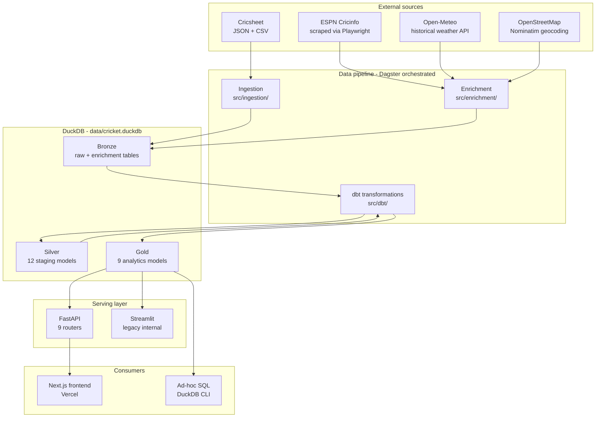
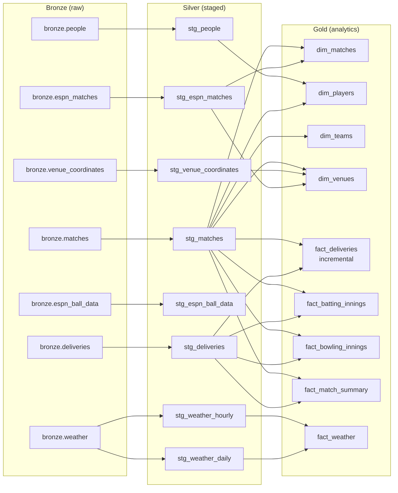
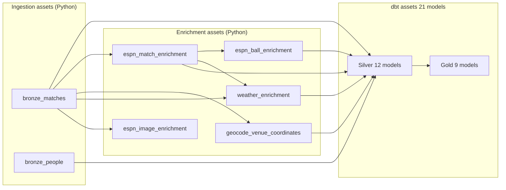
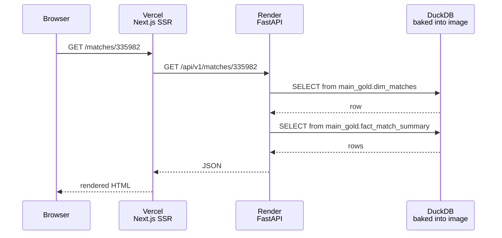
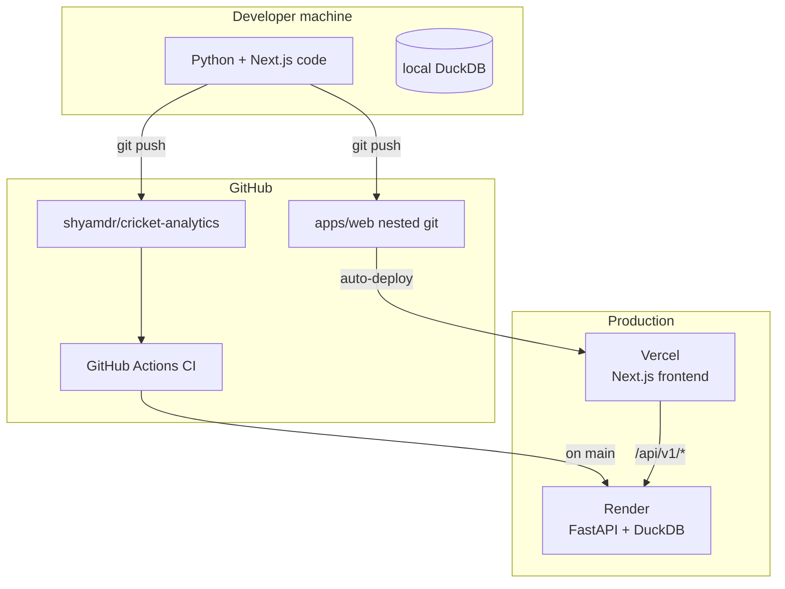

# Architecture

Visual reference for the InsideEdge / cricket-analytics platform. Complements the text description in the README and the detail in `.kiro/steering/project-architecture.md`.

## System Overview

## Medallion data flow

Note: ESPN silver models (stg_espn_*) and weather/geocoding silver models are gated behind the `source_exists` macro — if the bronze table hasn't been created by enrichment, silver returns an empty-shape result and gold still builds.

## Dagster asset graph

Jobs:
- `full_pipeline` — materializes everything
- `daily_refresh` — `AssetSelection.all()` with ingestion configured for the `recent_7` profile
- `enrichment_backfill` — enrichment group only, for historical scraping

Schedule: `daily_refresh` at 06:00 UTC.

## Request path (frontend → DB)

Note: Render free tier sleeps after 15 minutes idle. First request after idle takes ~30 seconds to spin up the container.

## Deployment topology

- CI does not deploy directly — Render pulls from `main` via its own GitHub integration
- The DuckDB file is rebuilt from scratch inside `Dockerfile.api` on every Render deploy (ingest + dbt seed + dbt run)
- Vercel deploys from the nested `apps/web/` git repo, independent of the root repo

## For more detail

- Per-model columns and grains — `.kiro/steering/dbt-models-reference.md`
- API endpoints — `.kiro/steering/api-endpoints-reference.md`
- Decisions and rationale — `docs/adr/`
- Current progress and backlog — `.kiro/steering/progress.md`
